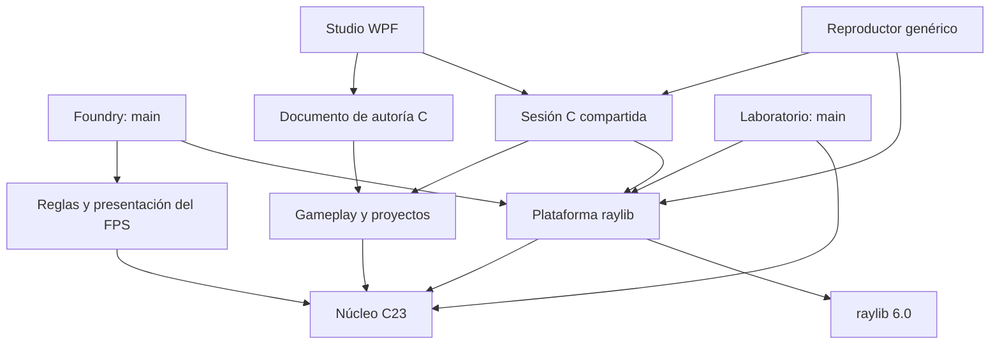
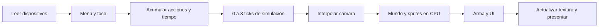

# 01 · Arquitectura e índice de archivos

## Dependencias permitidas

El núcleo no sabe qué es una ventana, un guardia o una pistola. Sus funciones
reciben datos explícitos. El juego puede simularse sin plataforma y el laboratorio
enlaza sólo `retro_platform` y `retro_core`. Compruébalo en CMake.

No hay contenedor de servicios, herencia simulada ni macros que escondan llamadas.
La encapsulación importante es la frontera entre módulos, no fabricar objetos
opacos para cada vector. `RePlatform` sí es opaco: sus recursos son específicos
de raylib y no deben escapar a otras capas.

`ReGameSession` posee una copia de `ReProject`, simulación, texturas, cámara,
entrada pendiente y renderer. Player y Studio llaman a su misma actualización.
Studio copia píxeles hacia WPF; Player presenta la textura con raylib. La interfaz
de autoría expone índices válidos durante una revisión; el paso a identificadores
estables para toda la autoría aún forma parte del plan Creator.

Los archivos de esta ampliación y sus contratos se enumeran en
[Studio](09-retroforge-studio.md#archivos-del-editor) y su estado se registra en
[seguimiento de Creator](15-creator-implementation.md).

## Un fotograma

El estado del juego sólo cambia en `fps_game_frame` (interfaz) o `fps_game_tick`
(simulación). `fps_game_draw` recibe `const FpsGame *`. Esta separación permite
renderizar varias veces sin consumir vida, munición ni tiempo.

## Propiedad de recursos

| Recurso | Propietario | Vida útil |
|---|---|---|
| `FpsGame` | `main` del FPS | Inicio → cierre; `free` único. |
| Mapa original y mutable | `FpsGame` | Copia por valor; no hay punteros internos. |
| Texturas CPU y sprites | `FpsArt` | Inicialización → `fps_art_destroy`. |
| Color y profundidad | `ReRenderer` | Inicialización → `re_renderer_destroy`. |
| Ventana, textura GPU y sonidos | `RePlatform` | `open` → `close`. |
| Tokens del mapa | Cargador | Préstamos de la línea actual. |
| Vértices recortados | Llamada de render | Arrays automáticos de capacidad fija. |

El búfer PCM temporal pertenece a `main`; raylib lo copia al cargar el sonido.
La exportación PNG construye una vista `Image` del framebuffer: no se libera
esa vista con `UnloadImage`, porque no posee los píxeles.

## Índice completo del código mantenido

### Raíz

| Archivo | Responsabilidad |
|---|---|
| `README.md` | Puerta de entrada, comandos, controles y documentación. |
| `CMakeLists.txt` | Targets, compilador, dependencia raylib, pruebas e instalación. |
| `CMakePresets.json` | Configuraciones Debug, Release, análisis GCC y UBSan con Clang. |
| `.gitignore` | Excluye descargas, herramientas y resultados de compilación. |
| `.editorconfig` | UTF-8, finales de línea e indentación. |
| `.clang-format` | Formato mecánico del C. |
| `THIRD_PARTY.md` | Dependencias, licencias y procedencia de los recursos. |
| `deep-research-report.md` | Investigación original, conservada intacta. |

### API pública: `include/retro`

| Archivo | Responsabilidad |
|---|---|
| `math.h` | Vectores, constantes, operaciones e intersecciones. |
| `world.h` | Volúmenes, marcadores, barreras, colisiones, trazas y navegación. |
| `render.h` | Texturas, framebuffer, cámara, triángulos, sprites y canvas. |
| `input.h` | Acciones, eventos pendientes y acumulador de tiempo fijo. |
| `platform.h` | Ventana opaca, presentación, dispositivos, imágenes y sonidos. |
| `gameplay.h` | Personajes, animaciones, fases, entidades generacionales y eventos. |
| `interaction.h` | Triggers, reglas, inventario, objetivos, diálogos, luces y snapshots. |
| `project.h` | Proyecto editable, rutas seguras, carga, guardado e importación. |

### Núcleo: `src/engine`

| Archivo | Responsabilidad |
|---|---|
| `math.c` | Punto más cercano, rayo-segmento y barrido círculo-segmento. |
| `map.c` | Formatos v1/v2/v3, validación 3D y guardado transaccional. |
| `world.c` | Pertenencia volumétrica, movimiento, trazas por canal y BFS. |
| `render.c` | Recursos CPU, cambio de base, clipping, rasterización y malla de sectores. |
| `canvas.c` | Rectángulos, líneas, fuente bitmap, texto y sprites de interfaz. |
| `input.c` | Conservación/consumo de eventos y límites de recuperación temporal. |

### Plataforma y aplicaciones

| Archivo | Responsabilidad |
|---|---|
| `src/platform/raylib_platform.c` | Única inclusión de raylib; adapta servicios al motor. |
| `src/fps/game.h` | Estado, parámetros y contratos públicos del juego de ejemplo. |
| `src/fps/game.c` | Marcadores, reinicio, menús, movimiento, disparos, IA y progresión. |
| `src/fps/art.h` | Propiedad de materiales, sprites y arma del FPS. |
| `src/fps/art.c` | Arte pixelado original y síntesis reproducible de sonidos. |
| `src/fps/view.c` | Dibuja escena, automapa, arma, HUD y menús desde estado de sólo lectura. |
| `src/fps/main.c` | Compone recursos, ejecuta el bucle y libera todo al salir. |
| `src/lab/main.c` | Segundo consumidor independiente, con sus propios materiales y controles. |
| `src/gameplay/gameplay.c` | Actor loader, A*, percepción, captura, fases, animación y barreras. |
| `src/gameplay/interaction.c` | Cola de eventos, reglas, triggers, diálogos, checkpoints y guardados. |
| `src/gameplay/project.c` | Manifiestos, rutas confinadas e importación de recursos. |
| `src/player/main.c` | Ejecuta proyectos dirigidos por datos sin recompilar sus reglas. |
| `src/studio/main.c` | Editor, historial, planta, inspector, prueba e importación/exportación. |
| `src/studio/raygui_impl.c` | Única implementación de raygui, aislada como tercero. |

### Datos, pruebas y herramientas

| Archivo | Responsabilidad |
|---|---|
| `assets/foundry.map` | Nivel de seis sectores con marcadores del FPS. |
| `assets/lab.map` | Dos sectores y un marcador de cámara para el laboratorio. |
| `assets/studio/haunted.retro` | Manifiesto del proyecto tutorial. |
| `assets/studio/levels/house.map` | Casa v4 con planta baja, escalera, circuito de persecución, arena y pasarela segura. |
| `assets/studio/logic/haunted.rules` | Showcase de triggers, drop, inventario, objetivos y luces. |
| `assets/studio/dialogues/haunted.dialogue` | Conversación ramificada con consecuencias. |
| `assets/studio/art/haunted-title.png` | Portada original adaptable del juego genérico. |
| `assets/studio/art/characters/*.png` | Billboards transparentes originales de los cuatro personajes de Haunted. |
| `assets/studio/README.md` | Recorrido jugable, sistemas demostrados, controles y procedencia del arte. |
| `assets/studio/actors/kidnapper.actor` | Perseguidora con captura y dos seguimientos. |
| `assets/studio/actors/warden.actor` | Jefe de dos fases y acciones combinables. |
| `assets/README.md` | Procedencia y edición de recursos. |
| `tests/test_main.c` | Contratos geométricos y simulación del juego sin ventana. |
| `tests/platform_test.c` | Presentación real: ventana, GPU, PNG, escalado y resize. |
| `tools/bootstrap.ps1` | Descarga verificada e instalación aislada. |
| `tools/build.ps1` | Configura, compila, prueba y empaqueta. |
| `tools/check.ps1` | Formato, análisis estático y verificaciones repetibles. |
| `tools/export-project.ps1` | Carpeta portable y ZIP de un proyecto sin código nuevo. |

### Documentación: `docs`

| Archivo | Tema |
|---|---|
| `00-empezar.md` | Uso, instalación, depuración y orden de lectura. |
| `01-arquitectura.md` | Este índice, dependencias y propiedad. |
| `02-c23-y-memoria.md` | Lenguaje, compilación, memoria, contratos y errores. |
| `03-matematicas-renderer.md` | De un punto del mapa al píxel final. |
| `04-mundo-fisica-ia.md` | Tiempo, colisiones, visibilidad y comportamiento. |
| `05-formato-mapas.md` | Gramática, restricciones y ejemplo de edición. |
| `06-crear-otro-juego.md` | Integración de un nuevo consumidor del motor. |
| `07-decisiones-ejercicios.md` | Adaptación de la investigación, ejercicios y evolución. |
| `08-verificacion.md` | Evidencia, comandos, rendimiento y límites de validación. |
| `09-retroforge-studio.md` | Flujo visual de creación, prueba y exportación. |
| `10-gameplay-y-personajes.md` | Percepción, A*, captura, animaciones y jefes. |
| `11-formato-v2.md` | Gramática de proyecto v2, mapa v4 y personaje. |
| `12-logica-interacciones.md` | Eventos, condiciones, acciones, triggers y tutorial de llave. |
| `13-dialogos-guardado-iluminacion.md` | Conversaciones, retry exacto, ranuras y luces por tiles. |
| `toolchain-versions.txt` | Snapshot de versiones instalado para la entrega. |

`.tools`, `.deps`, `build`, `dist` y `artifacts` son resultados locales. No forman
parte del código que necesitas mantener. Las cabeceras públicas describen los
contratos; los `.c` contienen el mecanismo. No incluyas un `.c` desde otro archivo.
