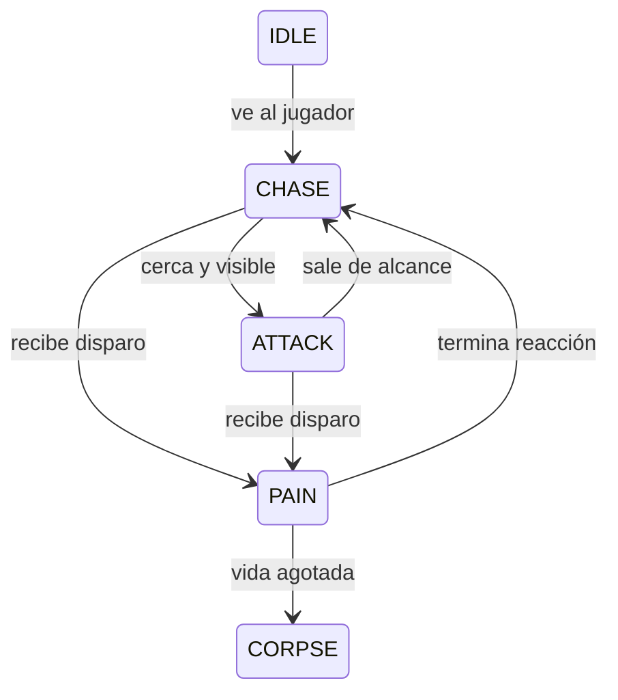

# 04 · Tiempo, mundo físico e inteligencia artificial

## Tiempo fijo y tiempo de presentación

El reloj real es variable. Una pantalla puede dibujar 120 veces por segundo
mientras la simulación avanza 60 veces. `ReClock` acumula segundos y extrae ticks
de `1/60`. El resto, dividido por la duración del tick, es alpha de interpolación.

```text
estado anterior ---- alpha ---- estado actual
```

Se interpola la cámara, no se vuelve a simular. Esta técnica añade una latencia
de interpolación de hasta un tick. La primera versión dibuja los enemigos desde
su último estado fijo; interpolarlos sería una ampliación localizada.

Un frame admite como máximo 0.25 segundos de tiempo añadido y ocho ticks de
recuperación. Si la máquina no da abasto, se descarta atraso y se contabiliza.
Evita la espiral en la que recuperar simulación provoca todavía más atraso.
En pausa se vacía el acumulador; al volver no se ejecutan los segundos pausados.

El movimiento del ratón es un desplazamiento, no una velocidad: **no se multiplica
por dt**. Se acumula si un frame no produjo tick y se consume una vez. Una tecla
mantenida persiste; una pulsación no se repite en todos los ticks de recuperación.

## Cilindro del jugador

`ReBody.position.z` son los pies. Radio y altura definen el volumen físico;
la cámara está 1.52 metros por encima de los pies. En la proyección horizontal
el cilindro es un círculo.

La cámara no decide la colisión. Usar un punto como jugador permitiría acercarse
tanto a las paredes que el near plane cortaría visualmente el mundo y los
movimientos en esquinas resultarían poco naturales.

## Barrido continuo

En lugar de mover y comprobar sólo el destino, buscamos el primer instante
`t ∈ [0,1]` en que el círculo móvil toca un segmento. Expandir el segmento por
el radio convierte el problema en un punto contra una cápsula.

La cápsula tiene dos caras paralelas y dos extremos circulares. Las caras se
resuelven con una ecuación lineal; los extremos, con una cuadrática. Se conserva
el menor impacto válido. Los tests incluyen un desplazamiento de 20 metros
para comprobar que una pared no se atraviesa por saltarse el punto de contacto.

Tras avanzar casi hasta el impacto, se proyecta el desplazamiento restante
sobre la tangente:

```text
remaining = remaining - normal * dot(remaining, normal)
```

Sólo se elimina la componente que entra en la pared. La componente paralela
produce sliding. Se resuelven como máximo cuatro contactos por tick. El pequeño
margen anterior al contacto reduce las penetraciones por redondeo.

El contrato exige que el cuerpo comience en una posición válida. No hay un
solucionador general de penetraciones profundas ni de cuerpos rígidos.

Foundry también bloquea el movimiento contra actores vivos mediante radios
sumados. Esa política vive en el juego; los cadáveres permiten pasar. Se detiene
al primer actor y no implementa empuje físico ni un sistema de multitudes.

## Escalones, gravedad y techos

Un portal permite pasar si:

1. El hueco entre el máximo suelo y el mínimo techo admite al cuerpo.
2. El suelo ascendente no supera su altura de paso cuando está apoyado.
3. Mientras está en el aire, sus pies ya han alcanzado el suelo de destino.

Gravedad actualiza velocidad vertical y después altura. El suelo detiene la
caída y marca `grounded`. El techo detiene la subida. Además se considera un
techo vecino cuando el círculo ya se solapa con el portal aunque su centro
todavía no haya cruzado: así un salto no atraviesa el dintel.

No hay salto doble: una pulsación sólo aplica impulso cuando `grounded` es
verdadero. El FPS usa metros/segundo y metros/segundo², no valores por frame.

## Rayos coherentes con el mundo visible

`re_world_raycast` devuelve la distancia al primer obstáculo. Prueba planos de
suelo/techo y aristas; una arista compartida no bloquea si la altura del impacto
cae dentro de su abertura. El parámetro dirección debe estar normalizado para
que la distancia quede expresada en metros.

La pistola calcula primero el obstáculo del mundo. Sólo acepta un impacto en
un cilindro enemigo si está más cerca. La percepción usa la misma consulta.
Abrir una puerta modifica el techo del sector: render, colisión y visibilidad
leen inmediatamente el mismo valor, sin tres versiones divergentes del estado.

## Enemigos como máquina de estados



Los guardias se activan al ver al jugador. Una vez alertados continúan buscando
su posición actual a través del grafo; esta versión no modela memoria limitada
ni búsqueda de última posición conocida. El ataque tiene alcance, línea de
visión y cooldown. El daño no se aplica una vez por frame de renderizado.

Cada sector es un nodo; cada conexión transitable es una arista del grafo. BFS
encuentra un camino de mínimo número de conexiones en un grafo sin pesos:
`O(V+E)` de tiempo y `O(V)` de memoria. Su array de padres reconstruye el primer
paso. No usamos A* porque este mapa pequeño no necesita costes de distancia.

El enemigo avanza al centro del portal y ligeramente más allá para cruzarlo.
Para mundos complejos habría que añadir navegación de radio, funnel, costes y
mejor comportamiento de multitudes. Es importante separar esas ampliaciones
de la corrección geométrica del renderer.

## Reinicio y estados globales

El juego conserva un mapa inicial y una copia mutable. Reiniciar restaura el
mapa, actores, pickups, vida, munición, temporizadores, sonidos pendientes y
puerta. Los ajustes de volumen y sensibilidad permanecen durante la sesión.

La derrota y la victoria detienen la simulación. Los menús siguen recibiendo
entrada. No hay guardado de partidas; cerrar y abrir crea una sesión nueva.
