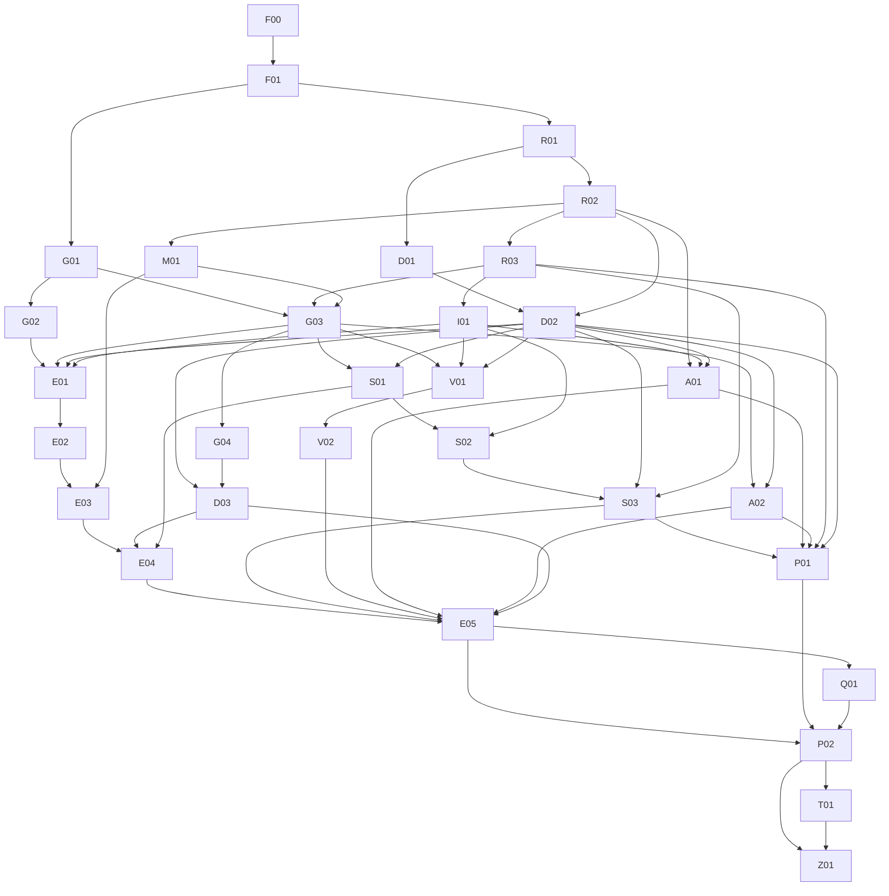

# Oleadas y dependencias

Generado de [backlog.json](backlog.json). Una oleada expresa profundidad de dependencias, no una barrera obligatoria ni autorización para escribir simultáneamente. Se puede adelantar un ticket cuando sus dependencias estén INTEGRATED y sus locks/archivos estén libres.

El coordinador puede usar menos workers que tickets. Además de locks se revisa el solapamiento real de archivos; ver [PLAN.md](PLAN.md).

| Oleada teórica | Tickets | Conflictos de locks dentro de la oleada |
|---|---|---|
| W00 | F00 | Ninguno declarado; verificar archivos |
| W01 | F01 | Ninguno declarado; verificar archivos |
| W02 | G01, R01 | Ninguno declarado; verificar archivos |
| W03 | G02, R02, D01 | Ninguno declarado; verificar archivos |
| W04 | R03, M01, D02 | Ninguno declarado; verificar archivos |
| W05 | I01, G03 | I01/G03: public-api |
| W06 | G04, E01, S01, V01, A01, A02 | G04/V01: gpu-backend; G04/A02: gpu-backend; S01/A01: public-api; V01/A02: gpu-backend |
| W07 | D03, E02, S02, V02 | Ninguno declarado; verificar archivos |
| W08 | E03, S03 | Ninguno declarado; verificar archivos |
| W09 | E04, P01 | Ninguno declarado; verificar archivos |
| W10 | E05 | Ninguno declarado; verificar archivos |
| W11 | Q01 | Ninguno declarado; verificar archivos |
| W12 | P02 | Ninguno declarado; verificar archivos |
| W13 | T01 | Ninguno declarado; verificar archivos |
| W14 | Z01 | Ninguno declarado; verificar archivos |

## DAG completo

## Elegibilidad actual

Por estado de dependencias: A01.

Filtrar después por alcance encargado y locks. BLOCKED requiere resolver su motivo y actualizar estado; no se relanza automáticamente.
