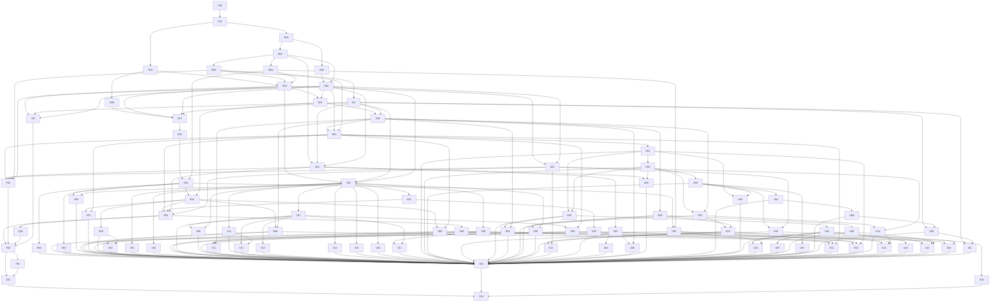

# Oleadas y dependencias

Generado de [backlog.json](backlog.json). Una oleada expresa profundidad de dependencias, no una barrera obligatoria ni autorización para escribir simultáneamente. Se puede adelantar un ticket cuando sus dependencias estén INTEGRATED y sus locks/archivos estén libres.

Z01 es el hito original; ZA1 integra la ampliación. El coordinador puede usar menos workers que tickets. Además de locks se revisa el solapamiento real de archivos; ver [PLAN.md](PLAN.md).

| Oleada teórica | Tickets | Conflictos de locks dentro de la oleada |
|---|---|---|
| W00 | F00 | Ninguno declarado; verificar archivos |
| W01 | F01 | Ninguno declarado; verificar archivos |
| W02 | G01, R01 | Ninguno declarado; verificar archivos |
| W03 | G02, R02, D01 | Ninguno declarado; verificar archivos |
| W04 | R03, M01, D02 | Ninguno declarado; verificar archivos |
| W05 | I01, G03 | I01/G03: public-api |
| W06 | J01, E01, S01, V01, A01, A02 | J01/S01: public-api; J01/A01: public-api; S01/A01: public-api; V01/A02: gpu-backend |
| W07 | E02, S02, V02, V03, V04, V06, V07, V11, V14, V15, V16, A03 | V02/V03: gpu-backend; V02/V04: gpu-backend; V02/V06: gpu-backend; V02/V07: gpu-backend; V02/V11: gpu-backend; V02/V14: gpu-backend; V02/V15: gpu-backend; V02/V16: gpu-backend; V03/V04: gpu-backend; V03/V06: gpu-backend; V03/V07: gpu-backend; V03/V11: gpu-backend; V03/V14: gpu-backend; V03/V15: gpu-backend; V03/V16: gpu-backend; V04/V06: gpu-backend; V04/V07: gpu-backend; V04/V11: gpu-backend; V04/V14: gpu-backend; V04/V15: gpu-backend; V04/V16: gpu-backend; V06/V07: gpu-backend; V06/V11: gpu-backend; V06/V14: gpu-backend; V06/V15: gpu-backend; V06/V16: gpu-backend; V07/V11: gpu-backend; V07/V14: gpu-backend; V07/V15: gpu-backend; V07/V16: gpu-backend; V11/V14: gpu-backend; V11/V15: gpu-backend; V11/V16: gpu-backend; V14/V15: gpu-backend; V14/V16: gpu-backend; V15/V16: gpu-backend |
| W08 | E03, S03, V05, V08, V10, V12, V13, V17, K08, A04, A05 | V05/V08: gpu-backend; V05/V10: gpu-backend; V05/V12: gpu-backend; V05/V13: gpu-backend; V05/V17: gpu-backend; V08/V10: gpu-backend; V08/V12: gpu-backend; V08/V13: gpu-backend; V08/V17: gpu-backend; V10/V12: gpu-backend; V10/V13: gpu-backend; V10/V17: gpu-backend; V12/V13: gpu-backend; V12/V17: gpu-backend; V13/V17: gpu-backend; A04/A05: audio-core |
| W09 | E04, P01, H01, H02, H03, H04, V09, K01, K09, U06 | E04/H01: wpf-viewport; E04/H02: wpf-viewport; E04/H03: wpf-viewport; E04/H04: wpf-viewport; P01/H01: document-core; P01/H02: document-core; P01/H03: document-core; P01/H04: document-core; H01/H02: document-core, wpf-viewport; H01/H03: document-core, wpf-viewport; H01/H04: document-core, wpf-viewport; H02/H03: document-core, wpf-viewport; H02/H04: document-core, wpf-viewport; H03/H04: document-core, wpf-viewport; K01/K09: runtime-core |
| W10 | E05, H05, H06, H07, H09, K02, X02 | E05/H05: wpf-viewport; E05/H06: wpf-viewport; E05/H07: wpf-viewport; E05/H09: wpf-viewport; H05/H06: document-core, wpf-viewport; H05/H07: document-core, wpf-viewport; H05/H09: document-core, wpf-viewport; H06/H07: document-core, wpf-viewport; H06/H09: document-core, wpf-viewport; H07/H09: document-core, wpf-viewport |
| W11 | Q01, H08, H10, K03, K05, K07, A06, H12 | H08/H10: document-core, wpf-viewport; H08/H12: document-core; H10/H12: document-core; K03/K05: runtime-core; K03/K07: runtime-core; K05/K07: runtime-core |
| W12 | P02, K04, K06, K10, U01, U02, U03, U07, H11, K12 | K04/K06: runtime-core; K04/K10: runtime-core; K04/K12: runtime-core; K06/K10: runtime-core; K06/K12: runtime-core; K10/K12: runtime-core; U01/U02: ui-core; U01/U03: ui-core; U01/U07: ui-core; U02/U03: ui-core; U02/U07: ui-core; U03/U07: ui-core |
| W13 | T01, K11, U04, U05, U08, K13, U10, U11, X03 | K11/K13: runtime-core; U04/U05: ui-core; U04/U08: ui-core; U05/U08: ui-core; U10/U11: document-core |
| W14 | Z01, U09 | Ninguno declarado; verificar archivos |
| W15 | I02 | Ninguno declarado; verificar archivos |
| W16 | X01 | Ninguno declarado; verificar archivos |
| W17 | ZA1 | Ninguno declarado; verificar archivos |

## DAG completo

```mermaid
flowchart TD
  F00[F00]
  F01[F01]
  G01[G01]
  R01[R01]
  G02[G02]
  R02[R02]
  R03[R03]
  I01[I01]
  D01[D01]
  M01[M01]
  G03[G03]
  J01[J01]
  D02[D02]
  E01[E01]
  E02[E02]
  E03[E03]
  E04[E04]
  S01[S01]
  S02[S02]
  S03[S03]
  V01[V01]
  V02[V02]
  A01[A01]
  A02[A02]
  E05[E05]
  Q01[Q01]
  P01[P01]
  P02[P02]
  T01[T01]
  Z01[Z01]
  H01[H01]
  H02[H02]
  H03[H03]
  H04[H04]
  H05[H05]
  H06[H06]
  H07[H07]
  H08[H08]
  H09[H09]
  H10[H10]
  V03[V03]
  V04[V04]
  V05[V05]
  V06[V06]
  V07[V07]
  V08[V08]
  V09[V09]
  V10[V10]
  V11[V11]
  V12[V12]
  V13[V13]
  V14[V14]
  V15[V15]
  V16[V16]
  V17[V17]
  K01[K01]
  K02[K02]
  K03[K03]
  K04[K04]
  K05[K05]
  K06[K06]
  K07[K07]
  K08[K08]
  K09[K09]
  K10[K10]
  K11[K11]
  A03[A03]
  A04[A04]
  A05[A05]
  A06[A06]
  U01[U01]
  U02[U02]
  U03[U03]
  U04[U04]
  U05[U05]
  U06[U06]
  U07[U07]
  U08[U08]
  U09[U09]
  X02[X02]
  H11[H11]
  H12[H12]
  K12[K12]
  K13[K13]
  U10[U10]
  U11[U11]
  X03[X03]
  I02[I02]
  X01[X01]
  ZA1[ZA1]
  F00 --> F01
  F01 --> G01
  F01 --> R01
  G01 --> G02
  R01 --> R02
  R02 --> R03
  R03 --> I01
  R01 --> D01
  R02 --> M01
  G01 --> G03
  R03 --> G03
  M01 --> G03
  G03 --> J01
  I01 --> J01
  D02 --> J01
  D01 --> D02
  R02 --> D02
  G02 --> E01
  G03 --> E01
  D02 --> E01
  I01 --> E01
  E01 --> E02
  E02 --> E03
  M01 --> E03
  E03 --> E04
  S01 --> E04
  G03 --> S01
  D02 --> S01
  S01 --> S02
  I01 --> S02
  S02 --> S03
  D02 --> S03
  R03 --> S03
  G03 --> V01
  I01 --> V01
  D02 --> V01
  V01 --> V02
  R02 --> A01
  I01 --> A01
  D02 --> A01
  G03 --> A02
  D02 --> A02
  E04 --> E05
  S03 --> E05
  V02 --> E05
  A01 --> E05
  A02 --> E05
  E05 --> Q01
  S03 --> P01
  A01 --> P01
  A02 --> P01
  R03 --> P01
  D02 --> P01
  E05 --> P02
  P01 --> P02
  Q01 --> P02
  J01 --> P02
  P02 --> T01
  P02 --> Z01
  T01 --> Z01
  E03 --> H01
  E03 --> H02
  M01 --> H02
  E03 --> H03
  E03 --> H04
  V01 --> H04
  E04 --> H05
  S03 --> H05
  E04 --> H06
  S02 --> H06
  E04 --> H07
  S03 --> H07
  E05 --> H08
  E04 --> H09
  H06 --> H10
  H09 --> H10
  V01 --> V03
  V01 --> V04
  V02 --> V05
  V01 --> V06
  V01 --> V07
  V07 --> V08
  V01 --> V08
  V07 --> V09
  S03 --> V09
  V06 --> V10
  S02 --> V10
  V01 --> V11
  V07 --> V12
  V11 --> V12
  V07 --> V13
  V01 --> V14
  V01 --> V15
  V01 --> V16
  V06 --> V17
  V07 --> V17
  S03 --> K01
  K01 --> K02
  K02 --> K03
  K03 --> K04
  A02 --> K04
  K01 --> K05
  K02 --> K05
  K05 --> K06
  S02 --> K06
  K02 --> K07
  S02 --> K07
  S02 --> K08
  K08 --> K09
  V01 --> K09
  K07 --> K10
  K08 --> K10
  K10 --> K11
  A02 --> K11
  A01 --> A03
  A03 --> A04
  A03 --> A05
  S02 --> A05
  A01 --> A06
  K02 --> A06
  K03 --> U01
  K01 --> U02
  K03 --> U02
  K05 --> U03
  U03 --> U04
  H02 --> U04
  U03 --> U05
  K08 --> U06
  K03 --> U07
  U01 --> U08
  I01 --> U09
  U08 --> U09
  H02 --> X02
  H06 --> H11
  H08 --> H11
  S03 --> H11
  H02 --> H12
  H05 --> H12
  K01 --> H12
  K07 --> K12
  A02 --> K12
  K10 --> K13
  K12 --> K13
  V09 --> K13
  U03 --> U10
  U03 --> U11
  U06 --> U11
  V06 --> U11
  V05 --> X03
  K04 --> X03
  I01 --> I02
  U09 --> I02
  H01 --> X01
  H02 --> X01
  H03 --> X01
  H04 --> X01
  H05 --> X01
  H06 --> X01
  H07 --> X01
  H08 --> X01
  H09 --> X01
  H10 --> X01
  V03 --> X01
  V04 --> X01
  V05 --> X01
  V06 --> X01
  V07 --> X01
  V08 --> X01
  V09 --> X01
  V10 --> X01
  V11 --> X01
  V12 --> X01
  V13 --> X01
  V14 --> X01
  V15 --> X01
  V16 --> X01
  V17 --> X01
  K01 --> X01
  K02 --> X01
  K03 --> X01
  K04 --> X01
  K05 --> X01
  K06 --> X01
  K07 --> X01
  K08 --> X01
  K09 --> X01
  K10 --> X01
  K11 --> X01
  A03 --> X01
  A04 --> X01
  A05 --> X01
  A06 --> X01
  U01 --> X01
  U02 --> X01
  U03 --> X01
  U04 --> X01
  U05 --> X01
  U06 --> X01
  U07 --> X01
  U08 --> X01
  U09 --> X01
  H11 --> X01
  H12 --> X01
  K12 --> X01
  K13 --> X01
  U10 --> X01
  U11 --> X01
  X03 --> X01
  I02 --> X01
  Z01 --> ZA1
  X01 --> ZA1
  X02 --> ZA1
```

## Elegibilidad actual

Por estado de dependencias: H01, H02, H03, H06, H09, K08.

Filtrar después por alcance encargado y locks. BLOCKED requiere resolver su motivo y actualizar estado; no se relanza automáticamente.
