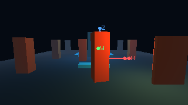
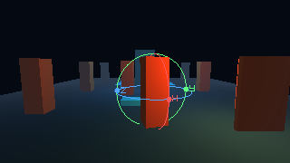
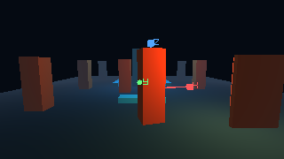
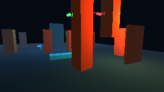

# E02 — gizmos, multiselección y comandos de transformación

Estado: **ticket formal implementado y verificado técnicamente; revisión interactiva del usuario pendiente**. Esta entrega cierra E02 según `backlog.json`, sin ampliar el alcance a la biblioteca de assets/inspector de E03.

Studio permite seleccionar varios UUID con Ctrl/Mayús en jerarquía o viewport, elegir Mover/Rotar/Escalar, espacio Mundo/Local, pivote Centro/Activo/Individual y paso de ajuste. Los gizmos se dibujan en el target OpenGL del viewport y el hit-test identifica su eje. El arrastre sigue la proyección del asa en pantalla, también con cámara orbitada; soltar publica una única operación y Escape cancela la vista previa sin cambiar documento ni borrar redo. Duplicar, borrar y cambiar padre actúan sobre el lote, con UUID nuevos y referencias padre-hijo remapeadas. Guardar/Reabrir conserva transforms e identidad. Piezas de la sala fija no ofrecen gizmo ni admiten cambios que rompan su abertura.

## Evidencia visual GPU

Estas capturas del viewport nativo en una NVIDIA GeForce RTX 5060 Ti muestran las tres herramientas con asas X/Y/Z; fueron inspeccionadas visualmente, además de verificarse el hit-test en los tres modos. Las capturas explícitas hacen readback; los frames ordinarios no.

## Verificación

| Comprobación | Resultado |
|---|---|
| Build nativo Debug con `-Werror` y WPF Tests Debug | PASS; WPF sin advertencias ni errores |
| CTest dirigido Debug: E02, regresiones Studio/room/door, Player, GPU, documento y física | **14/14 PASS** |
| Test host E02 | PASS: multiselección, preview/cancel/commit, redo, comparación Tool API, jerarquía rotada, ciclos/shear, batch duplicate/delete/reparent, remap de referencias, round-trip y guardas de sala |
| Test WPF E02 | PASS: UI, valores move/rotate/scale, gizmos/hit-test GPU, arrastre orbitado, undo/redo, lote y round-trip |
| Build nativo Release y WPF Tests Release | PASS; WPF sin advertencias ni errores |
| CTest dirigido Release: los mismos catorce casos | **14/14 PASS** |
| UBSan `vestigio_document` tras el cambio de UUID de Tool API | **1/1 PASS** |
| `tools/run-studio-3d.ps1 -NoLaunch` | PASS; 0 advertencias/errores |
| Recorrido manual del usuario en la ventana completa | **HUMAN_PENDING** |

## Cómo probar

Desde la raíz, ejecuta `powershell -NoProfile -ExecutionPolicy Bypass -File tools/run-studio-3d.ps1`. En **Editar**, usa **+ Añadir pilar** dos veces. Selecciona ambos con Ctrl/Mayús en **Jerarquía**, elige **Mover**, **Mundo**, pivote **Centro** y paso `0,25`. Arrastra el asa roja del gizmo: ambos objetos deben moverse y un solo **Deshacer** debe devolverlos. Durante otro arrastre pulsa **Escape**: no debe quedar modificación. Repite con **Rotar** y **Escalar**, prueba **Local** y los otros pivotes, y orbita la cámara para comprobar que el drag sigue el asa visible. Duplica ambos, cambia su padre y bórralos; usa Deshacer/Rehacer. Guarda una copia, reábrela y comprueba posiciones, rotaciones, escalas y jerarquía.

Límites: E02 edita entidades del documento actual, pero la biblioteca/importación general de modelos y el inspector generado por esquemas pertenecen a E03. Un gesto que produciría shear no representable en una jerarquía se rechaza antes de publicar y conserva historial. La vista previa usa una instancia GPU temporal; si un nivel extremo agota la capacidad del contexto, se rechaza sin modificar el documento. No se ha afirmado aceptación humana de ergonomía hasta que el usuario lo pruebe.
