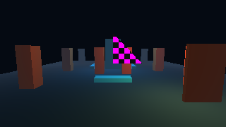
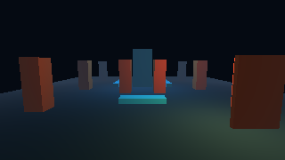
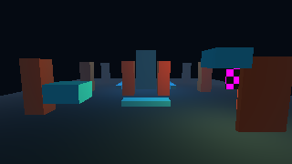
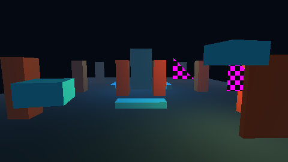

# E03 — inspector, jerarquía y biblioteca de assets

Estado: **ticket formal implementado y verificado técnicamente; revisión interactiva del usuario pendiente**. El trabajo se limita a E03; E04 no se inició.

Studio importa modelos `.glb` y `.gltf` autocontenidos a un manifiesto del nivel con UUID estable, ruta relativa y SHA-256. Una vista previa GPU temporal permite inspeccionar el modelo antes de colocarlo. Cada colocación crea una entidad distinta; las instancias comparten el asset y su material. El inspector genera campos tipados con unidades, rangos y referencias; al editar varios objetos conserva los campos no tocados y publica un solo lote de undo. Los errores aparecen junto al campo y en Problemas. Grupo, capa y ocultación son metadatos editoriales: no cambian el padre ni la visibilidad en Probar/Player. Renombrar y reimportar conservan el UUID del asset. Guardar como copia los modelos al nuevo directorio y reabrir comprueba el manifiesto, las entidades y las referencias.

## Evidencia GPU

Las capturas proceden del viewport OpenGL en una **NVIDIA GeForce RTX 5060 Ti**, OpenGL 3.3.0 NVIDIA 616.56. La captura WPF de ventana completa no incluye el `HwndHost` al renderizar fuera de pantalla; las imágenes de arriba son lecturas explícitas del target GPU. El recorrido Player sobre `build/e03-studio-test/saved/e03-edited.level.json` produjo **8 frames, 18 draws, 194 triángulos, 2 uploads y 1 readback**. En la prueba sintética, dos entidades importadas elevaron draws y triángulos respecto del Atrium base pero sólo sumaron un upload GPU, demostrando recurso compartido.

## Verificación

| Comprobación | Resultado |
|---|---|
| `tools/build.ps1 -Preset debug -Test` con apps activas | **45/45 PASS**; Studio 0 advertencias/errores |
| `tools/build.ps1 -Preset release -Test` con apps activas | **45/45 PASS**; Studio 0 advertencias/errores |
| `tools/build.ps1 -Preset analyze -Test` | **19/19 PASS** |
| `tools/build.ps1 -Preset ubsan -Test` | **19/19 PASS** |
| `vestigio_gpu_host_e03` | Importar GLB y glTF embebido, deduplicar, preview, colocar, lote/undo/redo, rename/reimport con bytes nuevos e ID estable, reimport inválido sin mutación, Save As byte-igual, reabrir y Probar: PASS |
| `vestigio_studio_e03` | UI, errores inline/Problemas, preview GPU, dos instancias, multi-edición, capa oculta en Editar y visible en Probar, copia por Save As, reabrir y reimportar: PASS; corrida adicional con glTF y material embebido PASS |
| `vestigio_player_e03_import` | Dos instancias compartiendo un upload, más draws/triángulos que baseline y rechazo de fingerprint obsoleto: PASS |
| Nivel guardado desde Studio, `tools/run-3d-demo.ps1 -Level ... -Smoke 8 -Capture ...` | PASS en GPU real; `uploads=2`, render visible |
| `tools/run-studio-3d.ps1 -NoLaunch` | PASS; 0 advertencias/errores |
| `clang-format --dry-run --Werror` en archivos C de E03 y `git diff --check` | PASS |
| `tools/check.ps1` completo | **Bloqueado por formato preexistente** en `include/vestigio/controller.h:59` (archivo ajeno a E03, sin cambios en este ticket); análisis y UBSan se ejecutaron por separado y pasaron |
| Recorrido manual en ventana visible por el usuario | **HUMAN_PENDING** |

## Cómo probar

Desde la raíz ejecuta `powershell -NoProfile -ExecutionPolicy Bypass -File tools/run-studio-3d.ps1`. En Editar pulsa **Importar GLB/glTF…** en **Biblioteca de assets** y selecciona `tests/assets/fixtures/static_triangle.glb`. Al seleccionarlo debe verse temporalmente en el viewport. Pulsa **Colocar** dos veces; verás dos triángulos de damero rosa/negro (es el material de respaldo de esta fixture). Selecciónalos con Ctrl en la jerarquía; cambia sólo `transform.position.x` en **Inspector** y aplica. Un Deshacer debe revertir ambos. Introduce escala `0`: aparece un error junto al campo y en **Problemas** sin cambiar el documento. Asigna la capa `Arquitectura`, ocúltala en Editar y pulsa **Probar**: los objetos reaparecen. Detén, guarda como una copia en otra carpeta, reabre y comprueba IDs, capa, posiciones y modelos. Ejecuta la copia en Player con `powershell -NoProfile -ExecutionPolicy Bypass -File tools/run-3d-demo.ps1 -Level "ruta\nivel.level.json"`.

El flujo actual acepta `.glb` y `.gltf` con dependencias embebidas; un `.gltf` que referencia buffers o imágenes externos se rechaza con diagnóstico antes de modificar el documento. Límite: 32 assets, 16 MiB por archivo y 128 MiB de fuentes por nivel. El fingerprint impide cargar silenciosamente un archivo que cambió fuera de Reimportar. El visor no posee las texturas compartidas; la vista previa usa una entidad nativa temporal que se destruye al dejar de previsualizar.
