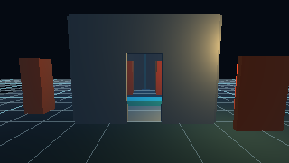
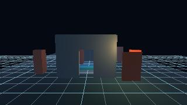
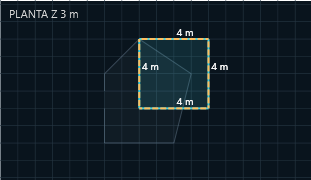
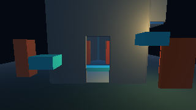
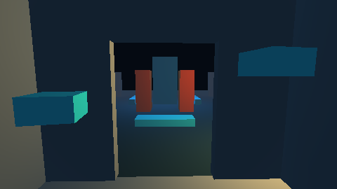

# E04 — habitaciones, aberturas y organización editorial

Estado técnico histórico: **ticket implementado y verificado en pruebas**. La revisión manual posterior del usuario **rechazó la usabilidad del Studio 3D** mostrado. Esta evidencia prueba funciones acotadas, no aceptación de la experiencia de creación ni que el editor esté listo para hacer un juego. Corregir esa experiencia queda pendiente antes de nuevos tickets funcionales. Los 60 tickets nuevos de la auditoría de `js-game` permanecen en el backlog; no se ejecutan en bloque.

Studio permite crear varias habitaciones mediante un rectángulo rápido o un contorno XY escrito en sentido antihorario. Una receta `vestigio.room` guarda vértices, planta Z, alto/grosor y aberturas de tipo puerta, ventana o hueco. La receta es la única fuente: al instanciarla se triangulan suelo y paredes, se generan UV y bounds, se carga la malla GPU y se crea un collider de triángulos con **las mismas posiciones**. La malla y la colisión se regeneran al editar, deshacer/rehacer y reabrir; no se serializan copias derivadas. Las aberturas quedan libres tanto visual como físicamente. La vista previa usa una instancia temporal que se descarta al cancelar sin modificar el documento ni el historial.

El plano de autoría muestra cuadrícula métrica, cotas, planta activa y contornos atenuados de otras plantas. El viewport GPU puede mostrar la cuadrícula y sus contornos; **Probar** y Player muestran todas las plantas sin aplicar el filtro editorial. El botón anterior **Sala del demo** conserva su ejemplo fijo; **Construir sala…** abre el panel de recetas editables.

Las capturas 3D proceden del viewport OpenGL en una NVIDIA GeForce RTX 5060 Ti, controlador 616.56. El plano es WPF y no controla el contenido de Player. La prueba de cancelación compara los PNG [antes](e04-room-before.png) y [después](e04-room-cancelled.png) byte a byte, además de revisión/conteo de entidades idénticos; por eso no queda geometría residual. El shell WPF completo no captura los píxeles de su `HwndHost`, así que la vista 3D se captura desde el target GPU.

## Verificación

| Comprobación | Resultado |
|---|---|
| `tools/build.ps1 -Preset debug -Test` | **49/49 PASS**; Studio 0 advertencias/errores |
| `tools/build.ps1 -Preset release -Test` | **49/49 PASS**; Studio 0 advertencias/errores |
| `tools/build.ps1 -Preset analyze -Test` | **20/20 PASS** |
| `tools/build.ps1 -Preset ubsan -Test` | **20/20 PASS** |
| `vestigio_room_recipe` | Planta cóncava, aberturas, UV/IR y geometría compartida, rechazo de autotoque y dimensiones inválidas: PASS |
| `vestigio_gpu_host_e04` | Preview/cancel de creación y sustitución temporal al editar, 270 recetas distintas en una sesión, crear/editar, undo/redo, guardar/reabrir, Play, paso por vano y bloqueo lateral prolongado: PASS |
| `vestigio_studio_e04_room` | Formulario, plano, dos plantas, ghost/grid, preview/cancel, edición, campos tras undo/redo, guardar/reabrir/Probar: PASS |
| `vestigio_player_e04_room` | Receta guardada en GPU real: Atrium base 16 draws/192 triángulos; con sala 17 draws/312 triángulos y 2 uploads: PASS |
| Revisión interactiva en ventana visible | **HUMAN_REJECTED: UX y organización del Studio 3D** |

## Cómo probar

Desde la raíz ejecuta `powershell -NoProfile -ExecutionPolicy Bypass -File tools/run-studio-3d.ps1`. Pulsa **Guardar como…** para trabajar sobre una copia. En **Editar**, pulsa **Construir sala…**; el panel propone un rectángulo frente a la cámara. Pulsa **Vista previa**, luego **Cancelar** y verifica que desaparece. Vuelve a previsualizar y pulsa **Crear habitación**. Selecciónala en la jerarquía, cambia el alto o una abertura y pulsa **Actualizar habitación**; usa **Deshacer/Rehacer**. Crea otra sala con **Planta Z** distinta y compara el plano con **Contornos de otras plantas** activado/desactivado. Guarda, reabre y pulsa **Probar**. Cruza el vano y comprueba que el muro vecino bloquea. Para jugar la copia fuera de Studio: `powershell -NoProfile -ExecutionPolicy Bypass -File tools/run-3d-demo.ps1 -Level "ruta\nivel.level.json"`.

Límites de este ticket: una abertura de tipo puerta es un vano y no instala hoja móvil; una ventana no crea todavía marco ni vidrio. Las herramientas avanzadas de perímetros, pisos conectados y huecos verticales se registran en H05/H06/H09/H10. El contorno se edita con coordenadas en el panel, no con trazos de mouse en el viewport. No se añade retrocompatibilidad ni migración del proyecto Three.js.
