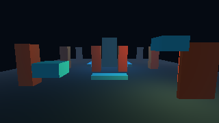
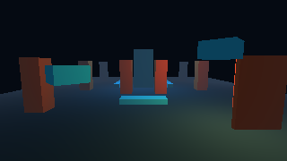

# Oleada 8 — animación rígida del Atrium

Estado: **flujo hobby implementado; revisión visual del usuario pendiente**. A02 permanece `IN_PROGRESS`: todavía no hay importación de clips glTF, skins/joints ni skinning GPU. No se inicia aquí la siguiente oleada editorial o de distribución.

Player y Studio **Probar** crean dos objetos flotantes sin collider que comparten malla y clip rígido, con relojes de reproducción independientes y fase inicial separada por un segundo. El clip de cuatro segundos interpola desplazamiento vertical y rotación; cada instancia conserva su propia pose y vuelve al inicio sin alterar el objeto de malla compartido. Studio **Editar** sólo muestra el documento original; Detener destruye las dos instancias temporales. El renderer sigue dibujando esas poses en GPU sin readback durante frames normales.

El núcleo `vg_rigid_*` valida clips, interpola transforms locales, avanza por tiempo fijo, permite pausar una instancia y distingue loop de fin de clip. Las dos instancias de esta demostración se definen en código, en `src/gamekit/atrium_animation.c`; aún no son clips importados o serializados en el nivel.

## Evidencia

Capturas del test nativo de Studio en una GPU NVIDIA GeForce RTX 5060 Ti, antes y después de treinta ticks a 60 Hz, con la cámara sin mover. El ensayo comprueba que los PNG difieren, que los dos objetos tienen fases iniciales distintas, que ambas alturas avanzan, que Stop elimina las instancias y que la revisión y bytes del nivel permanecen iguales. Las capturas son evidencia de pose y movimiento en el renderer; la experiencia visual final aún debe revisarse en pantalla.

## Verificación local

| Comprobación | Resultado |
|---|---|
| Build nativo Debug de Runtime, Player y GPU Host | PASS; C23 con `-Werror` |
| Build de Studio Tests Debug | PASS; 0 advertencias, 0 errores |
| CTest dirigido Debug: `vestigio_animation`, `vestigio_document_runtime`, `vestigio_studio_3d`, `vestigio_player_demo` | 4/4 PASS |
| Build nativo Release y WPF Tests Release | PASS; WPF 0 advertencias/errores |
| CTest Release: animación/documento, GPU renderer/scene, Player demo/puerta/visual/audio y Studio 3D/edición/puerta/visual/audio | 13/13 PASS |
| CTest UBSan: `vestigio_animation` y `vestigio_document_runtime` | 2/2 PASS |
| `vestigio_player.exe --smoke 120 --no-audio --settings build/w08-smoke.settings` | PASS; dos fases avanzaron, 120 frames, GPU real, 0 readbacks |
| Studio Play/Stop y dos capturas con cámara fija | PASS; diferencia visual y documento intacto |
| `tools/run-3d-demo.ps1 -Smoke 120 -NoAudio` y `tools/run-studio-3d.ps1 -NoLaunch` | PASS; GPU RTX 5060 Ti/OpenGL 3.3, scripts y copia de recursos actualizados |

## Cómo probar

Desde la raíz, ejecuta `tools/run-3d-demo.ps1`. Delante del punto inicial hay dos objetos cian que flotan y giran con un desfase entre sí. Camina alrededor y comprueba que se mueven sin cambiar las columnas ni bloquear el paso. En Studio (`tools/run-studio-3d.ps1`), abre el Atrium, pulsa **Probar** para verlos en movimiento y **Detener** para volver a la escena editable original. No guardes el nivel para observar el clip: los actores de prueba son temporales.

Límites: este entregable demuestra animación rígida con geometría compartida y pose por instancia. No anima esqueletos ni vértices, no sincroniza un collider a estos objetos decorativos y no ofrece todavía editor de clips ni persistencia de ajustes de reproducción. Su movimiento no convierte A02 completo en formalmente integrado.
