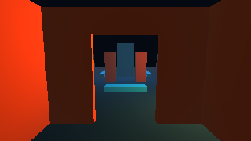

# Oleada 9 — habitación con abertura en Studio

Estado: **entregable hobby implementado y probado; revisión interactiva del usuario pendiente**. E04 permanece `PLANNED` según su dependencia formal de E03: esta oleada sólo aporta una plantilla fija, no un editor paramétrico de habitaciones y portales.

El botón **+ Habitación con abertura** añade seis tramos de muro alrededor del punto inicial del Atrium en una sola transacción. Las dos jambas y el dintel dejan un vano de **1,6 m de ancho y 2,2 m de alto**; cada tramo usa un cubo del modelo GPU y un collider box con la misma transformación. El piso es el Atrium existente. La acción selecciona una pieza, actualiza la jerarquía y se revierte o repite con un solo Deshacer/Rehacer. Guardar/Reabrir conserva los seis UUID y sus etiquetas. Probar instancia una copia y permite atravesar el vano, mientras el muro contiguo bloquea. Un segundo clic no superpone otra sala; duplicar o transformar sus piezas protegidas se rechaza para conservar el vano. Los pilares normales siguen siendo editables.

## Evidencia visual




Capturas del viewport nativo de Studio en NVIDIA GeForce RTX 5060 Ti/OpenGL 3.3, antes y después de la acción, con la misma cámara. El vano muestra el Atrium al fondo. La captura solicitada hace readback; los frames ordinarios no.

## Verificación del 2026-09-27

| Comprobación | Resultado |
|---|---|
| Builds nativos Debug y Release de host GPU, Player y pruebas dirigidas | PASS; C23 con `-Werror` |
| Build WPF Tests Debug y Release | PASS; 0 advertencias/errores |
| CTest dirigido Debug: sala GPU/colisión, Studio sala/edición/puerta, Player colisión/puerta, GPU renderer, documento/runtime, espacial y controlador | **11/11 PASS** |
| CTest dirigido Release: los mismos once casos | **11/11 PASS** |
| Test nativo `vestigio_gpu_host_room` | PASS: seis tramos y etiquetas, segundo clic y edición protegida sin mutación, undo/redo único, save/reopen, paso por vano central y choque lateral con el controlador real, 0 readbacks ordinarios |
| Test WPF `vestigio_studio_room` | PASS: botón, selección, dirty, etiquetas, piezas fijas frente a pilar editable, undo/redo, guardar/reabrir, Probar/Detener y archivos fuente intactos |
| `tools/run-3d-demo.ps1 -Smoke 180 -NoAudio -Level build/w09-core-debug/w09-room-copy.level.json` | PASS en RTX 5060 Ti; nivel guardado cargó y el jugador avanzó fuera del vano; 0 readbacks |
| `tools/run-studio-3d.ps1 -NoLaunch` | PASS |
| Recorrido manual del usuario en la ventana completa | **HUMAN_PENDING** |

## Cómo probar

Desde la raíz, después de `tools/bootstrap.ps1`:

```powershell
powershell -NoProfile -ExecutionPolicy Bypass -File tools/run-studio-3d.ps1
```

Pulsa **+ Habitación con abertura** en Editar. Deben aparecer seis entradas `Sala:` en la jerarquía y el marco del vano ante la cámara. Prueba Deshacer/Rehacer; selecciona una pieza de sala y comprueba que Duplicar e inspector están inactivos, mientras un pilar normal sigue siendo editable. Usa **Guardar como…** para crear una copia fuera de `assets/demo/`, **Reabrir** y **Probar**. Avanza con **W** por el vano; a un lado, la pared debe detenerte. **Detener** vuelve al documento guardado.

Para recorrer esa copia en Player, usa la ruta que elegiste al guardar:

```powershell
powershell -NoProfile -ExecutionPolicy Bypass -File tools/run-3d-demo.ps1 -Level "build/mi-sala.level.json"
```

Límites: es una plantilla fija de **una sala por nivel** sobre el piso existente del Atrium; no crea techo ni permite cambiar dimensiones, dibujar otra habitación o regenerar geometría desde una receta paramétrica. El marcador `vestigio.room_piece` conserva identidad/etiquetas y protege sus piezas, pero no es la autoridad de geometría de E04 completo. Tampoco crea una puerta móvil: el vano queda abierto. No se inicia E05 ni distribución en esta oleada.
