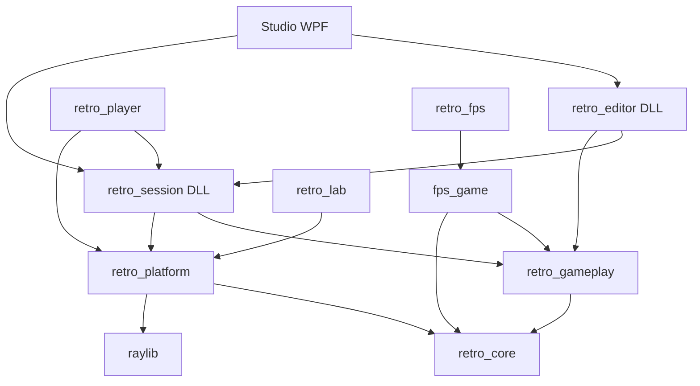

# 01 — Auditoría del engine actual

Fecha: 2026-09-20. Baseline: `4e0cb9c866dcb2aa59e0e12a333c600ca12a390d`. VESTIGIO es el nombre objetivo; el código todavía se llama RetroForge, usa `Re*`/`re_*` y targets `retro_*`. No se propone renombrarlo masivamente.

## Alcance y calidad de evidencia

Auditoría estática de cabeceras, implementaciones, composición CMake, editor WPF y pruebas. **Código localizado no equivale a comportamiento ejecutado ni a UX validada**. No se compiló ni ejecutó el motor en esta investigación. Los resultados históricos de `docs/15-creator-implementation.md` no se presentan como resultados nuevos.

El checkout estaba limpio al comenzar. Durante la lectura aparecieron cambios ajenos en `include/retro/project.h`, `src/engine/render.c`, `src/gameplay/project.c`, `src/session/session.c` y `tests/test_main.c`. Se extrajo el baseline a una carpeta temporal y las conclusiones de esta auditoría se refieren a ese commit. Antes de implementar el roadmap hay que reconciliarlo con el nuevo HEAD. Los enlaces relativos facilitan navegación, pero la referencia reproducible es `git show 4e0cb9c:<ruta>` y el símbolo indicado.

## Mapa del sistema real

Fuente: [CMakeLists.txt](../../CMakeLists.txt), `add_library`/`target_link_libraries`. La arista editor→sesión sólo existe con `RETRO_BUILD_APPS`. Hay separación real por targets, aunque no corresponde todavía a un SDK instalable. `retro_core` mezcla matemática, formato de mapas, colisiones, renderer, canvas e input: eso no exige seis bibliotecas nuevas.

| Archivo / símbolo | Responsabilidad actual | Dependencia o límite importante |
|---|---|---|
| [math.h](../../include/retro/math.h), `ReVec2`, `ReVec3`; `src/engine/math.c`, `re_sweep_circle` | Vectores y consultas geométricas | Tipos propios; XY suelo, Z altura; metros, segundos, radianes; exige C23 |
| [world.h](../../include/retro/world.h), `ReWorld`, `ReSector`, `ReMarker`, `ReBarrier` | Documento de geometría 2.5D y colocaciones | Arrays acotados sin punteros; 64 sectores, 16 vértices/sector, 128 marcadores/barreras, 16 materiales |
| [map.c](../../src/engine/map.c), `re_world_load`, `re_world_validate`, `re_world_save_v4` | Parser, validación, serialización y migración de mapas | Formatos textuales propios; candidatos antes de publicar; errores con línea |
| [world.c](../../src/engine/world.c), `re_body_move`, `re_world_trace`, `re_world_next_sector` | Movimiento barrido, rayos por canal, navegación entre sectores | Círculo XY con intervalo Z; no colisionador de malla 3D general |
| [render.c](../../src/engine/render.c), `re_draw_triangle`, `rasterize`, `re_draw_world` | Clipping, proyección, rasterización CPU y adaptación de sectores a triángulos | No utiliza raylib para renderizar geometría; UV con corrección de perspectiva |
| `render.c`, `re_apply_lights` | Iluminación sobre framebuffer/depth | Incluye `retro/interaction.h`, una dependencia conceptual del core hacia gameplay |
| [canvas.c](../../src/engine/canvas.c), `re_rect`, `re_text`, `re_blit` | HUD de píxeles sobre framebuffer | Fuente bitmap y UI inmediata; no sistema general de widgets |
| [input.c](../../src/engine/input.c), `re_input_accumulate`, `re_clock_advance` | Input semántico y acumulador de tiempo | Tick de 1/60, máximo ocho ticks por frame; conserva eventos hasta consumirlos |
| [raylib_platform.c](../../src/platform/raylib_platform.c), `RePlatform`, `re_platform_present` | Ventana, input físico, carga de imágenes, presentación GPU y PCM | Único adaptador que incluye raylib; una ventana; bindings concretos |
| [gameplay.c](../../src/gameplay/gameplay.c), `re_gameplay_spawn`, `re_gameplay_tick` | Actores definidos por datos, percepción, estados, eventos, animación sprite | Pools especializados; `ReEntityId` con índice/generación de 16 bits |
| [interaction.c](../../src/gameplay/interaction.c), `re_interaction_tick`, `re_save_write`, `re_save_read` | Reglas, inventario, objetivos, triggers, diálogos y partidas | Definiciones separadas del estado; cola acotada y protección ante ciclos |
| [project.c](../../src/gameplay/project.c), `re_project_load`, `re_project_import` | Manifiesto y agregado editable | Proyecto embebe un mundo y definiciones; importación es copia de archivo, no importador de modelos |
| [transaction.c](../../src/gameplay/transaction.c), `re_project_commit`, `re_project_recover` | Guardado coordinado de manifiesto/mapa/actores/reglas/diálogos | Preparación, backups y diario recuperable; no es autosave de cambios no guardados |
| [editor.c](../../src/editor/editor.c), `ReEditorDocument`, `begin_command`, `commit_command` | Documento autorizado e historial | 48 estados completos y un candidato; revisión; invalidación de índices entre revisiones |
| [session.c](../../src/session/session.c), `ReGameSession`, `tick`, `draw` | Composición de juego genérico y sesión compartida | Contiene disparos, proyectiles, pickups, menús, guardados y arte provisional |
| [player/main.c](../../src/player/main.c), `main` | Host de ventana para sesión | CLI mínima `--project`, `--smoke`, `--capture`, `--menu` |
| [fps/game.c](../../src/fps/game.c), `fps_game_tick`; `fps/view.c`, `fps_game_draw` | Juego FPS específico y presentación | Camino distinto del Player genérico; útil como consumidor externo de prueba |
| [StudioViewModel.cs](../../src/studio/ViewModels/StudioViewModel.cs), `BuildInspector`, `BuildSceneGroups`, `Play` | Presentación/acciones de Studio | Inspector manual, agrupaciones por tipo y asistentes de reglas |
| [MapViewport.cs](../../src/studio/Controls/MapViewport.cs), `OnMouseMove`, `OnMouseUp`, `Snap` | Edición en planta, habitaciones, arrastre y snapping | Movimiento XY por cuartos de unidad; un commit al acabar el gesto |
| [GameViewport.cs](../../src/studio/Controls/GameViewport.cs), `Frame`, `OnRender` | Preview jugable desde sesión C | Copia RGBA→BGRA a `WriteableBitmap` fijo de 480×270 |
| [export-project.ps1](../../tools/export-project.ps1) | Empaquetado Player + proyecto + DLL | Copia la carpeta completa del proyecto; no calcula cierre de dependencias |

## Flujo de un frame y ownership

Player obtiene `ReInput` y tiempo; `re_session_frame` acumula input, obtiene ticks, ejecuta `tick` y dibuja con interpolación. `tick` combina movimiento/jugador, actores, proyectiles, interacciones y transiciones de menú. `draw` construye cámara interpolada, mundo, sprites, luces y HUD. Player sube los píxeles a una textura GPU. Studio llama a la misma sesión y copia los píxeles a WPF; no reimplementa gameplay.

La pérdida de foco vacía input y acumulador en `re_session_frame`. Es un contrato valioso. La igualdad de simulación **no implica igualdad total de input**: `GameViewport.Frame` captura WASD y pasa `held=0`; el adaptador raylib construye `pressed` y `held`. Debe probarse paridad de acciones sostenidas antes de certificar ambos hosts.

| Recurso | Propietario | Préstamos / liberación |
|---|---|---|
| `ReProject` documental | `ReEditorDocument.states` | Cada comando copia valores; `re_editor_close` libera todos los estados |
| Proyecto de juego | `ReGameSession.project` | `re_session_create` copia; preview no publica al documento |
| `ReGameplay.world/definitions` | Sesión posee datos, gameplay los presta | `reset_game` vuelve a enlazar punteros después de copiar estados |
| `ReRenderer.pixels/depth`, `ReTexture.pixels` | Objeto inicializado | `destroy` simétrico; draw toma prestado durante llamada |
| Textura GPU y sonidos | `RePlatform` | `re_platform_close`: sonidos/audio, textura, ventana, plataforma |
| Píxeles en WPF | Array C# propio | `re_session_copy_pixels` copia; no se libera memoria C desde C# |

No hay asignador central ni contabilidad completa del proceso. `re_session_memory` estima arrays/framebuffer/texturas propios; no mide GPU, WPF, drivers ni todos los temporales. Las estructuras de capacidad fija ayudan hoy, pero el historial copiaría demasiado si se embebieran mallas/texturas dentro del documento.

## Renderer y mundo: la distinción decisiva

`re_draw_triangle` recorta seis planos, proyecta, usa regla top-left y depth buffer; `rasterize` interpola `u/z`, `v/z`, `1/z` y hace alpha test. Puede dibujar triángulos arbitrarios en espacio 3D. No tiene un recurso `Model`, una escena transformable ni importación de mallas.

`ReSector` es polígono convexo extruido entre suelo/techo. `re_world_sector_at` distingue volúmenes superpuestos por Z; eso habilita plantas apiladas, pero no convierte colisión, navegación ni geometría de autoría en 3D general. El renderer visita sectores y triangula su suelo/techo cada frame, sin un pipeline de mesh batches o BVH genérico.

Las puertas de `re_draw_world` suben: desplazan la cota inferior según `open_fraction`. La colisión bloquea el paso mientras la fracción es menor que 0,95 (`portal_clearance_blocks`). Tener la misma variable no implica que volumen visible y volumen colisionable coincidan continuamente. Una puerta con bisagra necesita un colisionador transformado, no otro umbral de apertura.

`re_apply_lights` usa tiles de 16×16 y hasta ocho luces por tile. Rechaza tamaños mayores de 1024 por eje, mientras `re_renderer_init` admite hasta 4096. No hay sombras geométricas en este pass: la reconstrucción de posición desde depth y la distancia/cone de luz no prueban oclusión por paredes. No hay fog ambiental configurable; el oscurecimiento `light/(1+z*0.045)` es atenuación artística fija.

## Capacidades que ya existen y no hay que reinventar

- Separación plataforma/core, matemática propia y input semántico.
- Clipping/rasterizador CPU, alpha test, sprites atlas, capturas headless.
- Mapas versionados y validación de portales recíprocos, alturas y referencias.
- Entidades de personaje con generación; definiciones inmutables frente a estado mutable.
- Reglas, triggers box/cylinder/sector, luces point/spot, diálogos con condiciones, inventario y objetivos.
- Sesión común Studio/Player, preview aislado, pausa y avance de un tick.
- Documento C autorizado, comando candidato y protección de redo ante cambios rechazados.
- Guardado coordinado recuperable. Preservarlo al ampliar serialización.
- Resolución interna separada, filtro nearest, escala entera y letterboxing: `re_platform_present` ya los implementa. Falta configurarlos y eliminar dimensiones fijas, no inventarlos.

## Deuda priorizada y ausencias verificadas en el baseline

| ID | Hallazgo | Consecuencia | Tratamiento propuesto |
|---|---|---|---|
| A01 | `render.c` incluye tipos de `interaction.h` | La iluminación básica está conceptualmente encima del core | Mover la descripción de luz a render/world cuando se toque ese contrato |
| A02 | `session.c` concentra gameplay, arte, UI, persistencia y render | La API de sesión ejecuta un juego incorporado, no cualquier juego C | Extraer composición del juego a módulo; preservar host/sesión |
| A03 | `editor.h` incluye `project.h`; exportación automática de DLL | La fachada oculta layout a WPF, pero no es un SDK público mínimo/versionado | Nuevo header público sin tipos internos ni raylib; exports explícitos |
| A04 | 480×270 repetido en sesión/copia/memoria/Player/WPF | Cambiar resolución en un sitio rompe contrato de buffers | Descriptor de superficie: dimensiones, formato, pitch y revisión |
| A05 | `app_init` carga sprites por definición, no por asset ID | Dos definiciones con la misma ruta pueden duplicar textura | Registro/caché compartido; instancias retienen handles |
| A06 | `colors` y `create_pickup_sprites` ignoran fallo de `re_texture_init` | Posible escritura por puntero nulo bajo fallo de asignación | Incluir prueba de fault injection antes de extraer recursos; no arreglado aquí |
| A07 | `ReMarker` tiene posición/yaw, no TRS/padre/pivot general | Modelos y puertas quedan forzados a semántica 2.5D | Transform + identidad general; adaptador legacy |
| A08 | `re_platform_sound` sólo 16 sonidos PCM; sesión sin llamadas de reproducción | Capacidad de plataforma no equivale a audio de proyecto completo | Voces/buses/música/emisores y conexión al runtime |
| A09 | Teclas/FPS/FOV/sensibilidad incrustados en hosts/sesión | No existe settings serio ni remapeo de controlador | Esquema común, validación y adaptación por host |
| A10 | Historial copia `ReProject` completo | Correcto ahora, caro para assets/escenas ampliadas | Mantener blobs de recursos fuera; cambiar a deltas sólo con medición |
| A11 | `re_save_write/read` cubre interacción/actores/barreras, no `ReSessionProjectile` | Una partida no captura necesariamente todo el estado de sesión | Contrato explícito de persistencia por componente y estado transitorio |
| A12 | `re_project_import` copia bytes; materiales de sesión procedurales | Importar archivo no crea modelo/material utilizable | Pipeline source→decode→normalize→validate→resource |
| A13 | Navegación BFS de sectores y trazado específico | No sirve por sí sola para puentes, props sólidos y puertas rotadas | API de consultas espaciales; backend legacy más colisión 3D |
| A14 | Exportación copia raíz completa | Incluye contenido innecesario; crecerá mal con caché/código | Empaquetar dependencias alcanzables y manifiesto de licencias |

No se localizaron sistemas generales de shaders de usuario, GLB/glTF, fog configurable, scene graph TRS, gizmos de autoría 3D, multiselección, materiales editables completos, música por streaming, game-module callbacks ni SDK instalable. El inspector y biblioteca actuales existen, pero su presencia no certifica todos los workflows pedidos.

`src/lab/main.c` es laboratorio; `src/fps` es ejemplo específico; `character_art.c` y generación de pickups/materiales son contenido provisional. No deben convertirse por accidente en requisitos del core. El comentario de raygui en CMake no corresponde a un target raygui efectivo: distinguir residuo documental de dependencia real.

## Evidencia de pruebas disponible

`tests/test_main.c`: `geometry`, `input_clock`, `maps`, `collisions`, `renderer_contracts`, `dynamic_lighting`, `partial_portals`, `reusable_gameplay`, `safe_door`, `interaction_journey`, `rule_cycle_guard`, `editor_document`, `visual_authoring`. `tests/session_test.c` cubre sesión compartida; `tests/studio/Program.cs` autoría/WPF. Son lugares para preservar/ampliar contratos, **no una ejecución PASS de esta investigación**.

Conclusión: la base es un engine/framework C23 especializado en sectores con herramientas de autoría ya valiosas. La evolución necesaria es generalizar datos y contratos selectivamente; un rewrite o una migración completa de UI destruirían más valor del que aportan.

## Cambios concurrentes observados al cierre

HEAD observado posteriormente: `ae48d31e4be47e25a5d2e7eba5d2b541c335fc82`. La comparación `git diff 4e0cb9c..ae48d31` comprende 36 archivos. Estos cambios no pertenecen a esta investigación. Se leyó el delta relevante para acotar la vigencia de los hallazgos anteriores; no constituye una nueva auditoría completa ni una ejecución de pruebas.

| Área / evidencia del delta | Cambio observado | Efecto sobre esta investigación |
|---|---|---|
| `include/retro/project.h::ReProject`, `src/gameplay/project.c`, `src/session/session.c::load_project_materials` | Rutas de imágenes por slot de material y carga de materiales del proyecto | A12 describe el baseline: ya no es correcto afirmar que todos los materiales de sesión actuales sean procedurales. Sigue faltando el importer de modelos y el sistema general de materiales/shaders/assets |
| `src/session/session.c::colors` y `app_init` | Se propaga el fallo de creación de textura | A06 está parcialmente corregido. `create_pickup_sprites` conserva llamadas sin comprobar en el delta examinado; revalidar antes de intervenir |
| `src/engine/render.c::re_texture_cell_uv` | Se admiten celdas completas aunque quede margen sobrante en el atlas | Considerarlo al preservar contratos del atlas; no exigir divisibilidad exacta basándose en el baseline |
| `src/engine/canvas.c::utf8_next`, `re_text`; `src/session/session.c::wrap_text` | Recorrido por puntos de código y glifos españoles | Mejora de texto actual; no equivale a un sistema completo de shaping/fuentes |
| `src/session/session.c::draw_actor`, `draw_npc` | Se amplían estados/animación representados | Sigue siendo animación especializada de sprites; no importación skeletal genérica |
| `tools/export-project.ps1` | Parámetro de nombre de ejecutable y validación del destino | Preservar la mejora; continúa la copia del contenido de la raíz del proyecto, por lo que A14 sigue siendo relevante |

No se observó incorporación de render GPU de geometría en ese delta. La decisión GPU y las fronteras propuestas permanecen válidas. La matriz conserva explícitamente el baseline; P0 exige reconciliar cualquier HEAD posterior antes de convertir estos hallazgos en tareas de código.
