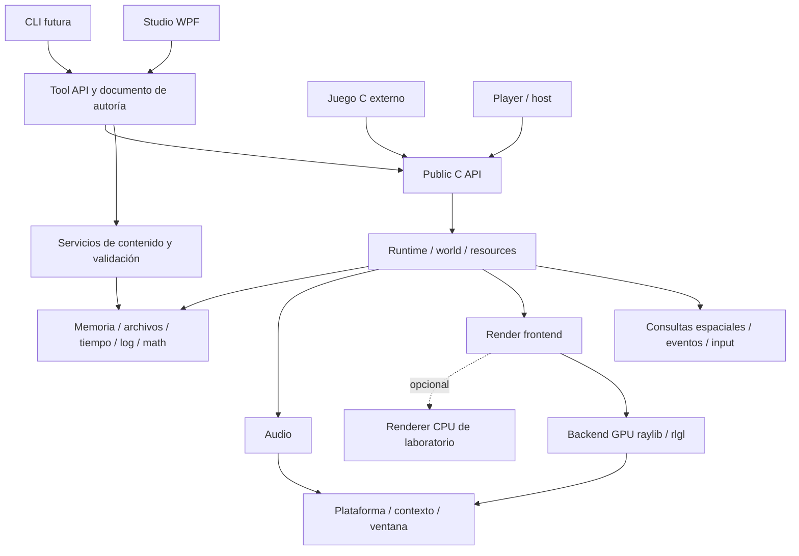

# 06 — Arquitectura objetivo e identidad de VESTIGIO

Estado: propuesta, no implementación. Incorpora la aclaración del usuario: **usar GPU cuando sea posible; no limitar el engine a CPU y RAM**. Baseline y evidencia en [01](01-current-engine-audit.md); decisiones de referencias en [03](03-reference-engines.md).

## Qué debería ser VESTIGIO

**Un motor retro 3D especializado, con runtime en C, render principal en GPU, SDK público y editor de autoría que consume los mismos contratos de mundo y contenido.** Incluye un conjunto opcional de helpers para FPS, horror e interacción. Un juego puede usar el editor, escribir C o mezclar ambos sin modificar internals.

El runtime es el producto fundamental; SDK es su distribución para desarrolladores; Studio es una aplicación de creación; Player es un host del juego incorporado o del game module seleccionado. El aspecto Neo-PSX es un perfil del renderer GPU, no otro motor. El renderer CPU existente queda como laboratorio/regresión y compatibilidad acotada, sin exigir paridad de shaders de usuario ni limitar features GPU.

VESTIGIO no promete inicialmente networking, mundo abierto, física general de rigid bodies, scripting seguro, editor multiplataforma, compatibilidad Doom ni ecosistema de plugins. Son ampliaciones posibles sólo si un juego real las necesita.

## Decisiones y alternativas descartadas

| ADR | Decisión | Evidencia y motivo | Alternativa descartada / cuándo revisar |
|---|---|---|---|
| D01 | Un runtime; autoría y juego con estado separado | `re_editor_start_session` ya copia a sesión; js-game pierde datos al tratar mesh como documento | Dos motores editor/runtime; no hay motivo para duplicar reglas |
| D02 | GPU OpenGL mediante raylib/rlgl como primera vía | raylib fijado ya expone `DrawMesh`, shaders y RenderTexture; Odin demuestra el circuito | CPU como techo; backend Vulkan/D3D12 propio antes de medir |
| D03 | Backend y perfil son ejes separados | `rasterize` CPU actual y shaders PSX requieren mecanismos distintos | `PSXRenderer` separado de `ModernRenderer`; duplicaría assets/escena |
| D04 | SDK estático inicial con callbacks | CMake ya tiene static libs; Quake muestra spawn/game code separado | Game DLL/hot reload obligatorio; añadir sólo con ABI y estado definidos |
| D05 | Entidad + componentes tipados + handles generacionales | `ReEntityId` ya valida generaciones; `ReMarker` no tiene transform general | ECS archetype/reflection universal sin evidencia de escala |
| D06 | Documento de autoría independiente de recursos cargados | Historial actual copia `ReProject`; recursos pesados harían prohibitivo ese modelo | Serializar structs runtime o clonar mallas por undo |
| D07 | glTF/GLB estático primero, importer desacoplado de GPU | js-game necesita caché transversal; raylib incorpora cgltf | Parser propio; Assimp como dependencia grande sin necesidad multiformato demostrada |
| D08 | Legacy sectores conservado como representación/adaptador | Portales/colisión/pruebas actuales tienen valor | Obligar al nuevo mundo a tener sector o reescribir todo el legado |
| D09 | Tool API transaccional sobre servicios públicos de contenido | Documento candidato actual ya protege redo y guardado | MCP dentro de core; duplicar serialización en automatización |
| D10 | Mantener WPF y resolver viewport GPU con spike temprano | `GameViewport` copia RAM; HwndHost implica foco/DPI/airspace | Reescribir Studio por estética o asumir interop GPU automática |

## Capas y dependencias permitidas



`Public C API` es una fachada, no una biblioteca que todo interno deba invocar circularmente. Internals implementan servicios, API pública valida y expone. Tool API añade documentos, revisión, transacciones, selección y serialización; puede llamar servicios comunes de contenido para trabajar sin dispositivo GPU.

Inicialmente bastan targets `vestigio_runtime` (estático), `vestigio_tool` (DLL para Studio o estático), `vestigio_player`, Studio y tests; `vestigio_gamekit` puede comenzar como módulo opcional, no otra jerarquía de frameworks. Archivos organizados por responsabilidad no obligan a crear una librería por carpeta. Se pueden conservar nombres `retro_*` hasta una migración de packaging concreta.

```text
include/vestigio/vestigio.h       # contrato público C
include/vestigio/tool.h          # contrato de documentos/herramientas
src/runtime/                    # lifecycle y composición, sin reglas de un juego
src/world/                      # entidades, transforms, componentes y eventos
src/assets/                     # catálogo, loaders y dependencias
src/render/                     # frontend, perfiles, materiales
src/render/gpu_raylib/           # recursos GPU y draw submission
src/render/cpu/                 # código actual preservado según necesidad
src/spatial/                    # ray/sweep/overlap y adaptador legacy
src/platform/                   # ventana, input físico, archivos de usuario
src/audio/                      # buses, emisores, voces y streaming
src/content/                    # codecs, validación y migración
src/tool/                       # documento, comandos e historial
src/gamekit/                    # control FPS, interacción, puertas, actores
games/foundry/                  # reglas/armas/menús del juego actual
src/studio/                    # WPF conservado
```

Es un mapa de responsabilidades objetivo. El roadmap mueve archivos cuando cambia su responsabilidad y conserva tests; no exige esta reorganización de una sola vez.

## Modelo de entidades evaluado

| Opción | Claridad C / serialización / edición | Coste y encaje |
|---|---|---|
| Jerarquía de objetos/clases | Requiere emular herencia/vtables; propiedades distribuidas | Innecesaria; semántica de tipo rígida |
| Scene graph universal | Excelente para relaciones espaciales; mezcla lifecycle con gameplay si todo es nodo | Usar sólo transform parenting opcional |
| ECS completo por archetypes | Iteración excelente a gran escala; mutaciones estructurales/queries más complejas | Sin evidencia que compense esa complejidad inicial |
| ECS-lite / entity+components | Pools claros por tipo; IDs estables y esquemas editables | **Elegido**, sin scheduler automático ni consultas genéricas obligatorias |
| Structs especializados | Muy simples para actores/puertas | Conservar dentro de componentes/gamekit; no una gran unión de todos los juegos |
| Handles | No es alternativa a ECS: es identidad/indirección | Elegidos para lifetime; UUID documental distinto |
| Data-oriented design | No es un modelo único: organiza datos según acceso | Arrays contiguos para transforms/renderables/colisión; medir antes de SoA extrema |

Entidad runtime: índice/generación, máscara de componentes, UUID de origen opcional. Componentes iniciales: Transform, MeshRenderer, SpriteRenderer, Collider, Camera, Light, AudioEmitter, Trigger. Los componentes de juego (Door, Actor, Interactable, Pickup) viven en gamekit o game module; no todos requieren un lugar en el core.

Identidad persistente: UUID textual, independiente de posición en arrays. Handle runtime: opaco, validado contra mundo/generación/tipo; destrucción no reutiliza generación válida. No serializar handles ni usar índices de inspector después de modificar revisión. Pools crecen por reserva explícita fuera del tick; errores de capacidad se devuelven, nunca se truncan silenciosamente.

Transform: posición, quaternion, escala; matriz local/world derivada. Mantener convención Z-up de VESTIGIO, convertir importación en la frontera. Padre opcional, rechazo de ciclos, profundidad acotada; reparent declara conservar local o world. Escala no uniforme con padres rotados puede producir shear: restringirla en authoring inicial o almacenar matriz derivada sin fingir que todo es TRS descomponible.

## Memoria, GPU y lifetime

CPU: simulación, metadata documental, decoding y colisión. GPU: buffers de geometría, texturas, programas, targets y draw execution. Los recursos CPU/GPU no tienen por qué tener la misma residencia ni lifetime.

Contexto runtime posee mundos/registro de assets; backend posee dispositivos y objetos GPU. Componentes retienen handles, no liberan texturas por su cuenta. Documento contiene descripciones/IDs; undo no copia VRAM ni arrays de vértices. Cargas nuevas y hot reload crean candidatos, publican en frontera de frame y retiran recursos viejos cuando ya no están usados. Inicialmente un hilo de contexto gráfico, sin render thread adicional ni job system obligatorio.

El host decide ventana, foco, eventos y pacing; la simulación recibe acciones semánticas. No reservar ni ejecutar OpenGL desde callbacks de audio, threads de importación o finalizadores C#. Descarga/parse CPU puede hacerse más tarde en workers; upload/destrucción GPU pasa por el propietario del contexto.

## Frame de referencia y separación game/render

1. Host bombea eventos y actualiza acciones; runtime acumula elapsed acotado.
2. Por tick fijo: aplica comandos pendientes, llama `fixed_update`, actualiza transforms y sistemas registrados (colisión, triggers, actores), entrega eventos; destruye entidades diferidas.
3. Transición de nivel se solicita durante tick y se confirma en frontera segura tras cargar/validar candidato. Si falla, nivel anterior continúa.
4. Render construye snapshot de presentación con transforms interpolados y cámara; game aporta comandos de UI/debug, no cambia simulación desde draw.
5. Backend GPU ejecuta passes y presenta; captura/readback sólo si se solicita. Se actualiza streaming de audio y se registra coste CPU/GPU.

No garantizar determinismo bit a bit entre compiladores/CPU por usar fixed timestep: RNG controlado y orden de sistemas ayudan a reproducción, pero física floating-point requiere tolerancias y pruebas explícitas.

## Migración de la geometría y colisión

`LegacySectorGeometry` mantiene niveles v1–v4 y sus reglas; genera mesh estático GPU una vez al cargar o editar geometría, en vez de triangulación por frame. `StaticMeshGeometry` añade mallas 3D con collider opcional. Un `SpatialWorld` expone raycast/sweep/overlap con máscara y devuelve entidad, posición, normal, fracción/distancia y material.

Primera implementación 3D: collider box/capsule para dinámicos y malla estática con aceleración BVH. Broadphase y narrowphase se separan conceptualmente, sin construir un motor de rigid bodies. No declarar modelos sólidos sólo porque se dibujan. Query de personaje debe resolver suelo, pendientes, escalones, techo y depenetración; las regresiones sectoriales siguen en el adaptador legado.

Navegación actual por sectores sigue en mapas legacy. En mundo libre, puntos de navegación y conexiones explícitas son un primer alcance válido; navmesh/streaming se posponen. Una puerta informa transitabilidad mediante su collider/estado, no únicamente `angle==max`.

## Puertas con bisagra

Base real: `Door.js` usa grupo-bisagra + panel desplazado; `ReBarrier` actual levanta un panel. Propuesta: entidad DoorRoot con transform estable, bisagra local (posición y eje normalizado), panel visual/collider con offset; motor cinemático de un grado de libertad.

Para un punto del panel: `M_panel = M_root * T(hinge) * R(axis, angle) * T(-hinge) * M_panel_rest`. Alternativa equivalente: entidad hijo Hinge que rota y panel hijo con offset. Elegir una representación de autoría canónica; no aplicar simultáneamente ambas y duplicar el pivot.

Datos: límites angular cerrado/abierto (radianes), sentido firmado, velocidad rad/s, optional acceleration, locked, key ItemId opcional, consume_key configurable, auto_close_delay opcional, máscaras, sonidos de comenzar/llegar/bloqueo, modo de interacción y política ante obstrucción. Estado: Closed/Opening/Open/Closing/Obstructed, ángulo actual/objetivo, timer y lock; unlock es evento explícito. Usar `move_toward` acotado al objetivo, sin overshoot dependiente de FPS.

Collider OBB/caja cinemática transformado con el mismo ángulo. Antes de confirmar avance, evaluar swept angular volume contra cuerpos: primera versión con subpasos limitados por desplazamiento máximo del extremo y margen; demostrar no tunneling dentro del rango admitido, rechazar velocidad/tamaño fuera de ese contrato. Colisionar también estando abierta: el panel sigue existiendo. Obstrucción al cerrar pausa o revierte según configuración; por defecto no aplasta. Trigger/llave/uso envían la misma solicitud validada.

Aceptar sólo cuando render, movimiento, raycast, triggers y navegación coincidan; test con puerta en ambas orientaciones, padre rotado, jugador en arco, bloqueo/llave, save/load y auto-close. La animación es estado de gameplay reproducible, no simplemente un clip visual.

## Automatización sin acoplamiento a IA

Public API permite creación procedural de mundo. Tool API permite modificar **documentos**: revision expected, operaciones tipadas, validación, preview/diff, commit/rollback e IDs devueltos. CLI futura consume esa Tool API para generar habitación/puerta/luces/entidades y guardar una sola transacción; archivos de nivel permanecen editables manualmente.

Una herramienta externa no escribe estado runtime del editor a escondidas. Si cambió la revisión, devuelve conflicto y un diff; no pisa cambios del usuario. MCP/IPC/RPC son adaptadores posteriores. No hace falta MCP para compilar un juego C ni para ejecutar `level validate`.

## Límites que requieren evidencia antes de cerrar arquitectura

- Viewport GPU embebido en WPF: prototipo de HWND/foco/DPI/docking, según [08](08-editor-architecture.md).
- Importación: subconjunto glTF y corpus de fallos; no prometer todos los exporters.
- Presupuesto GPU: medir meshes/sprites/luces en GPU integrada y dedicada; no deducir del benchmark CPU anterior.
- Licencia del SDK: no seleccionada; no bloquea escribir contratos/documentación, sí impide certificar una redistribución futura con código de terceros nuevo.

Estas incógnitas tienen pruebas y gates en [roadmap](12-roadmap.md); no justifican diseñar toda una plataforma de plugins por adelantado.
