# 09 — Pipeline GPU, perfiles retro y settings de vídeo

**Decisión principal: GPU para render de geometría, texturas, iluminación y postprocesado.** CPU mantiene simulación, consultas espaciales, decoding y preparación de comandos. El backend CPU existente no limita shaders ni mallas del producto objetivo.

Base: `src/engine/render.c::re_draw_triangle/rasterize/re_apply_lights` renderiza en CPU; `raylib_platform.c::re_platform_present` sólo sube RGBA y escala. raylib fijado `dbc56a87...` ya ofrece `LoadRenderTexture`, `LoadShader`, `DrawMesh`, `DrawMeshInstanced` y `UpdateMeshBuffer` en `src/raylib.h`. El [ejemplo Odin](sources-index.md#raylib-psx-odin) usa efectivamente esos mecanismos GPU.

## Backend seleccionado y presupuesto de abstracción

Primera opción: OpenGL 3.3 por raylib/rlgl, aprovechando ventana/input/audio existentes. API pública no expone `Model`, `Shader`, `Texture2D` ni IDs GL. Adaptador traduce handles propios a recursos backend. No crear capa RHI que imite todas las APIs gráficas: basta create/destroy resource, upload, begin/end target, draw batch, apply pass y present para los usos reales.

Revisar backend de plataforma si integración WPF exige un HWND/contexto distinto. Vulkan/D3D12/compute no son prerrequisitos para render retro GPU. Detectar capacidades y devolver unsupported si un perfil/custom shader requiere algo que no está disponible; no usar software silenciosamente bajo una etiqueta GPU.

## Flujo de frame

```mermaid
flowchart LR
  S[Snapshot world + cámara] --> C[Culling y batches CPU]
  C --> V[Vertex GPU: TRS, lighting, snapping opcional]
  V --> F[Fragment GPU: material, alpha, fog]
  F --> RT[Color + depth internos GPU]
  RT --> P[Postprocess GPU: ping-pong]
  P --> U[Upscale nearest + letterbox GPU]
  U --> HUD[UI de juego / overlays según capa]
  HUD --> W[Superficie nativa / ventana]
```

Orden propuesto: sky/background→opacos→alpha-cutout sprites→transparentes ordenados→efectos de escena→dither/cuantización final a resolución interna→upscale→UI nítida. HUD pixel-art puede dibujarse antes del post/upscale por elección de proyecto; menús/editor no deben volverse ilegibles por perfil. Un efecto puede declarar etapa y dependencias; evitar lista arbitraria sin validar orden.

Sector legacy se convierte a mesh al cargar/editar, con luz sectorial por vértice/material. Modelos y sprites emiten el mismo tipo de draw packet: mesh/submesh, transform, material, bounds y flags. No emitir un draw call por triángulo ni copiar todos los vértices a GPU cada frame.

## Modelo de recursos gráficos

MeshAsset contiene datos fuente/derivados CPU necesarios y uno o más buffers GPU compartidos. Instancia contiene transform y overrides. TextureAsset contiene imagen y sampler/política; evitar duplicar imagen por filtros distintos si el backend permite separación. Material referencia ShaderAsset + textures + bloque de parámetros. RenderTarget pertenece al renderer/superficie, no a cada entidad.

VRAM estimada: suma bytes de buffers/texturas/targets propios, distinta de memoria reportada por driver. Para RGBA8+depth32, 640×360 consume ~1,76 MiB; cada color de postprocess suma ~0,88 MiB, sin padding/driver/MSAA. 1920×1080 con ambos suma ~15,82 MiB. Son cálculos de tamaño, **no mediciones de consumo real**.

Mantener mallas estáticas en GPU, actualizar sólo transforms/params; instancing cuando se repiten mesh/material y métricas lo justifican. Frustum culling inicial con bounds; no requerir occlusion queries o GPU-driven rendering. Retener geometría CPU de colisión/edición cuando haga falta; liberar buffers CPU de render sólo si se puede reimportar/recrear contexto según política documentada.

Un hilo posee contexto gráfico; upload/release ocurren allí. Borrado/reload difiere hasta no tener comandos que usen versión anterior. No forzar `glFinish` cada frame; instrumentar stalls/readbacks y usar sincronización explícita cuando el backend requiera recursos en vuelo. No se promete recuperación universal de device loss sin pruebas.

## Materiales y shaders

| Nivel | Responsabilidad | Contrato |
|---|---|---|
| Default shader | Lit simple/unlit, texturas y fog | Siempre disponible en backend GPU soportado |
| Shader de material | Apariencia de objeto/superficie | Entradas semánticas documentadas, atributos/layout y parámetros tipados |
| Configuración global | Cámara, luces, entorno, perfil | No es un shader mágico que sobrescriba todos los materiales |
| Postprocess | Efecto de pantalla | Lee target y opcional depth; escribe otro target, nunca feedback ilegítimo |
| Preset | Valores iniciales + capacidades | No bifurca renderer ni modifica assets originales |

ShaderAsset: rutas vertex/fragment, backend/language version, defines permitidos, metadata de uniforms, texture slots, defaults/rangos/unidades y fingerprint. Metadata de inspector no se infiere de nombres de uniforms: declaración explícita para propiedades editables. Ver inspiración en `GLDefsParser::ParseShader`, `FShader::Load` ([GZDoom](sources-index.md#gzdoom)).

Caché por contenido + defines + backend/capabilities; invalidación de dependencias includes. Compilar candidato, capturar log con archivo/línea, validar parámetros, cambiar en frontera de frame. Error conserva último shader válido; primer load fallido usa error material visible o rechaza build según criticidad. Custom shader tiene variante GPU declarada; CPU opcional reporta no soportado.

Primera versión cubre posiciones/UV/normales/color por vértice, alpha opaque/mask/blend, culling/double-sided y texture tint/emissive. Normal maps/PBR completo/sombras de todos los focos no se asumen por aceptar glTF. Importer registra funciones no soportadas y una conversión artística explícita a material retro.

## Perfiles visuales

| Parámetro | CLEAN / MODERN ligero | RETRO_SOFTWARE | PSX | CUSTOM |
|---|---|---|---|---|
| Backend habitual | GPU | GPU | GPU | GPU compatible |
| Resolución interna | Configurable | Baja | Baja | Configurable |
| Filtro | Nearest o linear | Nearest | Nearest | Declarado |
| UV | Perspectiva | Perspectiva | Afín opcional/mezcla | Shader |
| Posición proyectada | Continua | Continua | Snapping configurable | Shader |
| Color | Full RGB | Paleta/LUT opcional | Cuantización 5-bit opcional | Parámetros |
| Luz | Simple por material | Sectorizada/quantizada | Vertex/simple, límite explícito | Dentro de capacidades |
| Fog | Off/linear/exp | Distancia/bandas | Distancia/bandas | Shader/entorno |
| Extras | Off por default | Off | Dither opcional | Cadena validada |

MODERN significa perfil limpio del motor pequeño, no promesa de renderer AAA. El perfil RETRO_SOFTWARE corre en GPU; el nombre describe el resultado visual. No reproducir orden de triángulos ni precisión exacta del hardware PS1 salvo que un juego lo requiera.

Técnicas: snapping se aplica a posición proyectada antes de rasterizar; clip/near-plane deben seguir siendo robustos. Afín usa `noperspective` o técnica equivalente sobre UV, no ruido de postprocess. Dither indexa píxel **interno**, cuantización ocurre después de fog/lighting, sin cambiar exposición al redimensionar ventana. No copiar el fog del ejemplo Odin: usa clip-z y un comentario linear aunque la fórmula sea exp. Definir distancia en view/world units y color-space explícito.

Jitter aleatorio, CRT, glitch, viñeta y aberración son efectos artísticos, no requisitos técnicos PSX. El diseñador puede apagar snapping/affine conservando el resto del perfil para reducir inestabilidad visual. Settings de accesibilidad pueden limitar efectos de movimiento/destello sin reescribir materiales.

## Resolución y presentación

Datos independientes: logical window size, tamaño físico del drawable (DPI), internal target width/height, display aspect y escala. Modo internal fixed (320×180, 426×240, 640×360) **o** porcentaje de drawable; no dos autoridades simultáneas. Preset propone valores; overrides del usuario son visibles.

Sea `s=min(W/w,H/h)`. Escala entera: `floor(s)` si s≥1; si ventana menor que target, política declarada: reducir target o usar downscale fraccional. Centrar rectángulo destino; barras fuera de él. En 1920×1080: 320×180→6×; 640×360→3×; 426×240→4× = 1704×960 y barras laterales 108/verticales 60. En fit fraccional, 426:240 no es exactamente 16:9: conservar aspecto, no estirar por defecto.

Resize recrea targets candidatos y publica al completarse; no muta framebuffer que otro host está leyendo. `SurfaceInfo` informa width/height/format/pitch/revision para capturas/fallback CPU; GPU presenta por surface handle. No transportar pixeles de GPU a WPF en cada frame normal. `re_session_copy_pixels` queda API legacy o captura solicitada, no el contrato principal.

Fullscreen exclusivo y borderless son modos diferentes; no mapear ambos a F11. VSync y FPS cap no deben añadir dos esperas incompatibles: política de pacing del host, simulación fija independiente. Guardar monitor/tamaño válido; hotplug/reinicio restaura ventana visible y configuración anterior si falla aplicar.

## Luces, fog y sombras

Primero forward simple con límite de luces por draw y culling CPU determinista por influencia/prioridad; comenzar con presupuesto pequeño parametrizado, medir antes de tiled/clustered GPU. Luz sectorial legacy se puede conservar como factor de base. Exponer luz omitida por límite en overlay, nunca hacerla desaparecer sin diagnóstico durante autoría.

Fog de mundo: color, start/end o density, modo lineal/exponencial, aplicación a sky y transparencias definida. Fog volumétrico, scattering y shadow maps múltiples son fases posteriores. Sombras: empezar sin ellas o con una luz seleccionada sólo tras medir; no atribuir oclusión física a la iluminación actual de `re_apply_lights`.

## Settings comunes

Formato propuesto JSON UTF-8 versionado (mismo parser del contenido), separado del mapa. Orden: defaults engine→defaults proyecto→preferencias usuario→overrides de sesión/CLI. Las restricciones/capacidades validan el valor efectivo; no se guardan overrides temporales como si fueran defaults.

| Dominio | Campos mínimos | Aplicación |
|---|---|---|
| Video | window mode/size/monitor, VSync, FPS cap, internal size/scale, filter, aspect/integer, FOV, profile/effects | Algunos inmediatos, otros requieren targets/window; rollback si falla |
| Audio | master/music/SFX/ambience, device si soportado | Buses persistentes, mezcla validada 0..1 |
| Input | actions, key/mouse/gamepad bindings, sensitivity, deadzone, invert | Mismo action map en WPF y Player |
| Gameplay | namespace de juego y schema version | El game module registra valores/defaults |
| Debug | overlays/loglevel/collision/wireframe/profiler | Sesión/developer por defecto; no alterar release silenciosamente |

Validación: tipos, finite, límites, enums soportados, keybind conflicts y dependencias entre campos. Valores inválidos producen diagnóstico + default seguro; archivo corrupto se conserva para recuperación. Save temp+replace; migraciones secuenciales; versión futura no se sobrescribe. Registro tipo CVar inspirado en Quake/GZDoom, sin comandos arbitrarios como formato de settings.

## Evidencia requerida

Escenas GPU: triángulo near-plane, malla no indexada/indexada, 100 instancias compartidas, alpha-cutout sprite delante/detrás, transparencias, corredor con luces, modelo animado cuando se implemente, PSX con cámara móvil. Capturar GPU real y perf, no equivalencia pixel-perfect CPU/GPU.

Medir CPU simulation/prepare/submit/present, tiempo GPU por pass con consultas asincrónicas si soportadas, frame p50/p95/p99, draw calls, triángulos, uploads, readbacks y RAM/VRAM estimada. Verificar render GPU con captura de comandos o herramienta gráfica disponible; ver CPU bajo no basta. Presupuesto objetivo inicial 60 FPS a 640×360 es una hipótesis de producto hasta definir hardware/corpus; benchmark anterior de CPU no lo certifica.

Aceptación: resize/DPI/fullscreen sin aspect corruption, mismo perfil en Player/editor, recursos liberados al recargar, shader inválido no mata sesión, no readback continuo y al menos un juego C externo con malla GPU. El backend CPU sólo necesita sus pruebas de geometría/regresión existentes.
