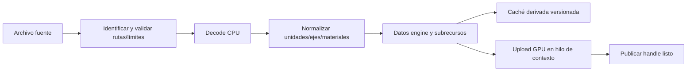

# 10 — Recursos compartidos e importación de modelos

Propuesta. Prioridad: GLB/glTF y recursos GPU compartidos. Base: `session.c::app_init` carga sprite por definición; `project.c::re_project_import` copia bytes; js-game `AssetLoader` tiene caché, pero `SceneLoader` lo omite. Ver [01](01-current-engine-audit.md), [02](02-threejs-engine-archeology.md) y [raylib/cgltf](05-source-provenance.md).

## Tres identidades distintas

1. **AssetId persistente**: UUID, identifica recurso aunque se renombre/mueva el archivo.
2. **Handle runtime**: índice/generación/tipo/contexto opacos; válido mientras se retenga. No guardar en mapas.
3. **Fingerprint de contenido/importación**: hash de bytes fuente, dependencias, opciones y versión de importer. Invalida caché; no reemplaza AssetId.

Registro: AssetId→tipo/ruta relativa/settings/dependencies/subresources. Inspiración: `Godot ResourceUID::get_id_path` y `ResourceLoader::load` ([fuentes](sources-index.md#godot)). Dos rutas con mismos bytes pueden compartir blobs derivados, pero no se fusionan identidades editoriales automáticamente. Dos configuraciones distintas del mismo modelo son variantes explícitas.

## Tipos y ownership

| Tipo | Datos compartidos | Estado por instancia / propietario |
|---|---|---|
| Texture | Imagen, formato/color space, mips y GPU texture | Sampler/material reference, UV transform; no imagen por entidad |
| Model/Mesh | Submeshes, buffers GPU, bounds, nodos/bind pose | Transform, overrides de material y visibilidad |
| Material | Shader/texture refs y defaults | Override tipado opcional; copy-on-write lógico, no mutar global accidentalmente |
| Shader | Fuentes, includes, metadata, programas/variantes GPU | Param blocks por draw/material |
| Sound | PCM comprimido/decodificado según política | Voice con playhead, volume, pan, pitch |
| Music | Fuente streaming/metadata | Stream por reproducción, buffers acotados |
| Font | Métricas, glyph atlas/texture | Layout de texto y color por UI |
| Level | Documento validado y assets requeridos | World mutable instanciado |
| Animation | Clips, tracks/keyframes | Tiempo, blend, pose/joint matrices por entidad |

La sesión/contexto posee AssetManager; entidades retienen recursos. Manager controla destrucción real y dependencias. Texture compartida por varios materiales no se libera al destruir uno. Material→textures/shader, Model→meshes/materials/clips, Level→assets. Rechazar ciclos de dependencias fuertes; relaciones de gameplay entre entidades no son ownership de assets.

`acquire` incrementa retención; componente que usa asset retiene por separado; `release` invalida la retención del usuario, no necesariamente el recurso compartido. Cuando refs=0, recurso es evictable, no necesariamente se destruye inmediatamente. Política inicial: memoria acotada con caché por contexto y purge al cambiar proyecto; LRU sólo si medición lo requiere. `unload_unused` y diagnóstico de refs pendientes. GPU libera en hilo/contexto dueño.

Una tabla única atiende Editor, Player y código. Para async futuro, `Loading` comparte operación en vuelo por clave canónica; cancelación de un consumidor no cancela a los otros. Completar carga después de cerrar contexto no puede publicar recursos huérfanos. Inicialmente cargas síncronas fuera del tick son aceptables y mucho más sencillas.

## Pipeline de importación

Importer no necesita ventana. Upload GPU es fase independiente, permitiendo validar/cocinar assets en CLI/headless. Publicar catálogo sólo después de validar y guardar fuentes/meta de manera coherente. Si upload falla, mostrar diagnóstico y mantener versión anterior; no perder archivo original.

Formato elegido: **GLB primero para intercambio compacto; glTF 2.0 con recursos externos dentro del proyecto como siguiente recorrido equivalente**. OBJ sólo para mallas estáticas simples si hay un asset real que lo requiera; no provee el mismo contrato de escena/animación/materiales. No adoptar FBX como dependencia inicial.

La [especificación glTF](https://registry.khronos.org/glTF/specs/2.0/glTF-2.0.html) define nodos, transforms, buffers/accessors, materiales y animación. Especifica sistema derecho con Y-up y unidades métricas. VESTIGIO conserva Z-up y convierte en importación, sin imponer a sus usuarios la convención interna de raylib.

## Implementación candidata y alternativas

raylib ya implementa `rmodels.c::LoadGLTF` mediante cgltf, expone `LoadModel/LoadModelAnimations` y upload/draw GPU. Es útil para spike, pero cargar directamente `Model` en cada entidad reproduce el fallo de js-game. No adoptar el layout raylib como formato público.

Recomendación de producción: importer privado basado en cgltf, traduciendo al IR propio de Mesh/Material/Node/Animation; GPU adapter puede usar `UploadMesh`/`DrawMesh`. Permite validación/rutas/IDs y cooking sin contexto. Reusar la dependencia fijada o fijar una copia directa con avisos MIT, evitando dos implementaciones incoherentes compiladas por accidente. No portar `LoadGLTF` entero sin justificar ownership; revisar su cobertura real frente al corpus.

`cgltf_parse[_file]` describe documento; cargar buffers y validar son pasos explícitos, no suponer que parse exitoso equivale a asset seguro/renderizable. Parser JSON para niveles no debe depender del parser glTF. Assimp sólo reconsiderar si necesidades multiformato compensan tamaño/build/licencias; glTF propio desde cero se descarta.

## Subconjunto inicial con errores explícitos

| Característica | Primera entrega | Política |
|---|---|---|
| Mesh triangles, índices y atributos position/normal/UV/color | Sí | Bounds/rangos/tipos comprobados; default si atributo opcional falta |
| Jerarquía de nodos, matrices/TRS y varias primitives/materials | Sí para modelos estáticos | Conservar nodos/subrecursos y transform de instancia |
| Imágenes PNG/JPEG, textura base, emissive, alpha mask | Sí | Imágenes vía loader existente con límites; color-space por semantic |
| PBR completo, normal/occlusion maps | No garantizado | Diagnóstico de conversión a material retro; conservar fuente |
| Samplers/wrap/double-sided | Sí según backend | Advertir degradaciones, no reemplazar a ciegas por perfil |
| Animación de nodos rígidos | Siguiente incremento | Tracks/tiempos propios de instancia |
| Skins/skeletal animation | Incremento posterior | Clips compartidos, pose CPU y skinning GPU; límites bones/weights explícitos |
| Morph targets, Draco/meshopt/KTX2 y otras extensiones | Fuera del primer alcance | Rechazar extensión requerida no soportada; nunca aceptar y dibujar basura |
| Cámaras/luces del asset | Importación opcional declarada | No reemplazar cámara de juego ni ambiente del nivel automáticamente |

El resultado visible temprano es modelo estático con materiales/texturas y muchas instancias compartidas. Animación sigue en roadmap; no bloquea todos los modelos, pero tampoco se anuncia glTF completo con ese primer hito.

## Normalización y datos derivados

Conversión posible glTF→VESTIGIO: `(x,y,z)→(x,-z,y)`, rotación propia con determinante +1. Aplicar una vez coherentemente a posiciones, normales, transforms, inverse bind matrices y tracks; para matrices de transform, cambio de base `C*M*C^-1`. Backend adapta cámara/matriz a su convención sin duplicar conversión del asset.

Normales usan inversa transpuesta ante escala no uniforme. Escala negativa cambia winding: tratar explícitamente al hornear o renderizar; no descartar todas las caras. UV/image orientation se define en importer/backend, no se invierte dos veces por copiar recetas de Three.js. Metros por defecto; factor de importación override con preview de dimensión humana/puerta y bounds numéricos.

No recentrar modelo automáticamente: destruiría pivots y jerarquía. Ofrecer ajuste explícito de origen con compensación de transform. Subrecurso usa identificador almacenado (UUID derivado del asset+nodo estable mapeado en meta), no sólo nombre visible de nodo; reimport que elimina/renombra nodos genera diff y referencias rotas resolubles.

Colliders separados: none/box/capsule/static mesh, receta guardada en meta o componente. No hacer que cada triángulo ornamental sea collider dinámico. Mesh collision puede simplificarse/cocinarse fuera del tick; versión de algoritmo en fingerprint.

Caché `.vestigio/cache/` es desechable, fuera de control de versiones. Fuente+meta pertenecen al proyecto; caché puede regenerarse en otro equipo. Incluir hash de dependencias externas, opciones de ejes/escala/materiales y versión de importer. No confiar en mtime como única invalidación.

## Validación del importador

Rechazar traversal/URIs remotas no autorizadas, tamaños desbordados, índices fuera de rango, accessors/offsets/strides inconsistentes, números no finitos, ciclos de nodo y extensiones requeridas no admitidas. Límites configurables para bytes/triángulos/texturas/nodos. Son contratos de archivos de proyecto externos, no infraestructura específica de IA.

Corpus: cubo indexado/no indexado, dos materiales, alpha-cutout, nodos anidados, escala negativa/no uniforme, GLB con textura embebida, glTF externo, textura ausente, truncado y extensión no soportada. Para animación: skin de dos huesos, dos instancias en tiempos distintos y pivots. Cerrar sólo al guardar/reabrir y ejecutar tanto desde Studio como C.

## Audio y recursos adicionales

raylib ofrece `LoadSound`, aliases y MusicStream, pero el adaptador actual sólo expone PCM limitado. Ampliar wrapper con SoundAsset/Voice y `UpdateMusicStream` dentro del loop de host; voces con límites/prioridad, buses master/music/SFX/ambience, listener derivado de cámara/jugador y distancia en metros. Stereo pan no sustituye por sí solo audio 3D completo.

Shaders y fonts usan el mismo registro de IDs/retenciones. No encajar Music y Sound en el mismo lifetime: una canción larga no debe decodificarse entera por instancia. Entidades AudioEmitter pueden instanciar voces compartiendo datos, no playheads.

## Instrumentación y aceptación

- Colocar 100 instancias de un Model mantiene una carga lógica/fingerprint y buffers GPU compartidos; transforms distintos. Medir número de decodes/uploads, no sólo RAM final.
- Destruir 99 mantiene la restante; destruir todas deja recurso evictable; purge libera CPU/GPU con contexto válido.
- Reimport válido actualiza todas las instancias que siguen el AssetId; inválido conserva versión anterior y muestra error.
- Renombrar/mover dentro del proyecto conserva IDs; export calcula dependencias transitivas y avisos de assets usados.
- Recargar proyecto repetidamente no crece de forma monótona fuera de caché declarada; stats separan metadata, payload CPU, staging y VRAM estimada.
- No copiar o liberar `Model`/`Material` raylib de forma superficial por entidad; wrapper documenta exactamente qué llamada backend destruye cada recurso compartido.
