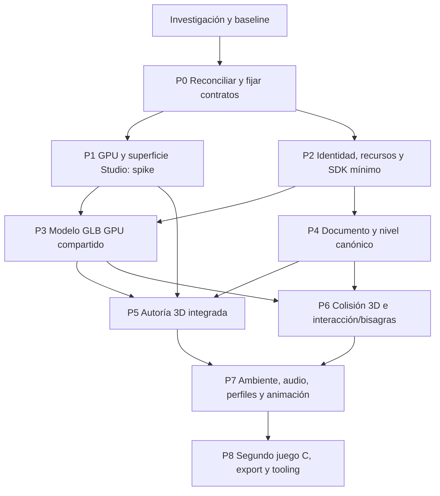

# 12 — Roadmap por dependencias y recorridos verificables

Estado: planificación derivada de investigación; **no se implementaron features del engine en esta entrega**. La GPU es requisito principal confirmado por el usuario. Los hitos son resultados revisables, no promesas de fechas ni estimaciones de rendimiento sin hardware definido.

Este roadmap se concreta en el [plan ejecutable para agentes](../implementation/README.md). Para asignar trabajo, usar sus tickets y dependencias; este documento explica las fases y decisiones que los motivan.

## Dependencias

GPU y contrato de mundo se estudian en paralelo conceptual, pero no se estabiliza SDK de render antes del spike. Importación de modelos aparece temprano; no espera a un editor perfecto. Shaders mínimos/targets son parte de P1/P3, mientras presets/art direction llegan en P7. El registro de recursos no se diseña completo antes de tener un modelo real que lo ejercite.

## P0 — Reconciliar baseline y congelar contratos de preservación

**Objetivo / por qué:** pasar del baseline investigado al checkout integrado, preservando trabajo concurrente y evitando planificar deuda ya resuelta.

**Dependencias:** investigación 01–11. **Tareas:** revisar diff desde `4e0cb9c`; mapear hallazgos A01–A14 a nuevo HEAD; identificar componentes que cambian en otra tarea; acordar contratos públicos iniciales y corpus de proyectos legacy; inventariar dependencias/avisos. Sin renombrado masivo.

**Resultado visible:** baseline reproducible y lista de capacidades actuales/pendientes con fuentes. **Aceptación:** ejecutar builds/checks requeridos del candidato integrado, guardar resultados; mapas/portales/undo/preview siguen funcionando. Registrar hardware/driver y proyecto usado en futuros benchmarks.

**Riesgos:** cambios concurrentes y pruebas históricas mal interpretadas. **Deuda resuelta:** estado de evidencia y ownership de próximos cambios. **Desbloquea:** todo el roadmap. La elección de licencia del SDK se prepara aquí; su publicación no se certifica sin decisión del titular.

## P1 — GPU y superficie nativa: prueba arquitectónica temprana

**Objetivo / por qué:** demostrar que el renderer principal usa GPU y que existe una vía viable hacia Studio, antes de construir más UI sobre copias RAM.

**Dependencias:** P0. **Tareas:** contexto raylib/OpenGL, mesh de prueba, shader, target interno, upscale y contadores; Player GPU separado; spike HwndHost/lifecycle/foco/DPI; evaluar single-context y límites de raylib. Preservar renderer CPU para tests existentes.

**Resultado visible:** geometría y sprite GPU con resolución interna independiente; viewport experimental nativo o informe de bloqueo técnico concreto.

**Aceptación:** identificar draw GPU real, no sólo upload de framebuffer CPU; cero readback por frame normal; resize/letterbox/filter coherentes; shader inválido diagnosticado; recursos liberados. Para cerrar vía embebida: foco, minimizado, docking, varios DPI/monitores y repetición abrir/cerrar. Ventana externa demuestra backend, pero no completa autoría integrada.

**Riesgos:** airspace, contexto/ventana raylib, stalls por present y drivers. **Deuda resuelta:** A04 parcialmente, techo CPU de render. **Desbloquea:** shaders custom, modelos GPU, viewport 3D. **Gate:** si embedding no es viable con coste acotado, decidir superficie/host alternativo con evidencia; no continuar escondiendo readbacks como solución final.

## P2 — Identidad, recursos y SDK mínimo en una vertical

**Objetivo / por qué:** un programa C externo debe crear world, cámara y entidades sin tocar `session.c`.

**Dependencias:** P0; coordinar contrato surface con P1. **Tareas:** header público independiente C11/C++; context/world/entity handles; Transform; callbacks de juego; separar reglas incorporadas del lifecycle; AssetId/handle y un recurso Texture/Mesh; ownership/refcounts/diagnósticos; esquema pequeño de settings/input. Export explícito de DLL de tooling.

**Resultado visible:** programa C externo y Player usan mismo runtime con mundo mínimo. **Aceptación:** consumidor fuera del repo instala/enlaza SDK; no includes internos/.NET; stale handles, wrong context, capacidad/OOM y double-release se rechazan; input por acciones compartido entre hosts; init/shutdown parcial seguro.

**Riesgos:** ABI prematura, code-first limitado a wrappers de juego incorporado. **Deuda resuelta:** A02/A03/A05/A07/A09 en su núcleo. **Desbloquea:** recursos genéricos y generación por código. Evitar game DLL/hot reload, reflection/ECS general y todos los asset types en esta etapa.

## P3 — GLB estático con materiales y recursos GPU compartidos

**Objetivo / por qué:** cumplir pronto la prioridad de modelos importados y validar assets con un caso real.

**Dependencias:** P1 + P2. **Tareas:** importer cgltf/GLB, normalización Z-up/metros, submeshes/nodos/materials/textures, caché con fingerprint, upload GPU único, diagnóstico/placeholder, instancias con TRS; glTF externo como segunda fixture del mismo contrato. Convertir sectores legacy a mesh GPU derivado al cargar/editar.

**Resultado visible:** escena con habitación legacy y modelos GLB/texturas/sprites, 100 instancias de un recurso.

**Aceptación:** mismas fuentes desde C y carga documental; bounds/ejes/alpha correctos; una carga/upload por recurso compartido; destruir instancias no invalida otras; purgar libera GPU; truncado/índices inválidos/extensión requerida no soportada producen error; perfil clean básico y wireframe funcionan. Modelo visible sin collider se identifica como tal.

**Riesgos:** ownership raylib, pérdida de materiales/nodos, conversión doble de ejes, VRAM no instrumentada. **Deuda resuelta:** A05/A12 y coste de geometría legacy por frame. **Desbloquea:** importación productiva, material inspector y mallas 3D. Skins/morphs no son condición de este primer hito.

## P4 — Formato de proyecto/nivel y documento canónico

**Objetivo / por qué:** cerrar la brecha crear→guardar→recargar que fallaba en js-game.

**Dependencias:** P2; integrar assets de P3 cuando estén disponibles. **Tareas:** JSON versionado, schema/validadores, UUIDs/referencias, componentes/overrides, environment, legacy adapter, transacción de guardado, migraciones sobre copia; Tool API de lotes/revisión; autosave separado de save.

**Resultado visible:** un nivel generado por código/herramienta se abre y vuelve a guardarse sin perder propiedades.

**Aceptación:** round-trip por cada componente; unknown optional preservado y required rechazado; refs rotas con JSON path/EntityId; error no modifica documento; recuperación tras fallo de commit; migración de Haunted/Foundry conserva portales/reglas/diálogos. Export de transform usa una sola representación.

**Riesgos:** dos serializers C/C#, pérdida de datos de extensiones, duplicación de geometría autorizada. **Deuda resuelta:** A07/A10/A11 parcialmente y límites del agregado `ReProject`. **Desbloquea:** authoring completo, CLI futura, colaboración código/editor.

## P5 — Autoría 3D integrada

**Objetivo / por qué:** producir contenido con edición directa sobre viewport GPU, conservando la sencillez de Studio.

**Dependencias:** P1 embebido + P3 + P4. **Tareas:** EditWorld/cámara editorial, picking, gizmos TRS, local/world, multiselección, duplicar/borrar/reparent, snapping, inspector por esquema, hierarchy/layers, asset browser; recipes de habitaciones/huecos/plantas; preview aislado. Mantener undo actual y cambiar storage sólo si memoria lo exige.

**Resultado visible:** importar modelo→colocar→transformar→agrupar→guardar→Probar desde Studio.

**Aceptación:** un drag/un lote es un undo; Escape cancela; rechazo conserva redo; selección por ID sobrevive cambio de índices; geometría/collider editado sincroniza; abrir/cerrar sesión no guarda cambios ni altera partidas; pasos equivalentes por Tool API producen mismos datos. Capturas reales y prueba humana de flujo, DPI y docking.

**Riesgos:** costo de interop, estado visual paralelo, jerarquía de editor confundida con parent runtime. **Deuda resuelta:** límites de inspector/viewport/selección actuales. **Desbloquea:** world building 3D y herramientas de ambientes. No convertir toolkit completo de Godot en dependencia.

## P6 — Consultas 3D, interacción y puertas con bisagra

**Objetivo / por qué:** la geometría importada debe funcionar como espacio jugable; la puerta debe ser un objeto físico coherente.

**Dependencias:** P3 + P4; UI completa se integra en P5. **Tareas:** API ray/sweep/overlap, static mesh/BVH y colliders dinámicos simples, controlador cápsula/box con suelo/pendientes/escalones; DoorRoot/hinge/panel, estados, key/lock, obstrucción y auto-close; Interactable/Trigger conectados a reglas; navegación legacy preservada y waypoints mínimos en 3D.

**Resultado visible:** recorrer un nivel con props sólidos, activar trigger y abrir/cerrar puerta giratoria con llave/sonido.

**Aceptación:** collider sigue panel en ambas orientaciones y al abrir completamente; cierre sobre cuerpo no atraviesa/aplasta por defecto; sweep angular dentro de límites documentados; ray/visión/proyectil/movimiento coherentes; trigger enter/exit/once/cooldown reproducibles; load/save conserva ángulo/lock/timer según contrato. Pruebas con padre rotado, geometría estrecha y velocidades extremas admitidas.

**Riesgos:** tunneling, depenetración, colisión visual distinta, decidir navmesh antes de necesitarla. **Deuda resuelta:** A07/A13 y puerta vertical como único patrón. **Desbloquea:** horror/exploración 3D jugable. Física completa de rigid bodies/vehículos/ragdolls queda fuera.

## P7 — Ambiente, audio, perfiles retro y animación

**Objetivo / por qué:** dar identidad retro configurable sin fragmentar engine ni renderer.

**Dependencias:** P5 + P6; shader/targets básicos ya existen en P1/P3. **Tareas:** materiales/shader metadata, shader reload seguro, luces/fog GPU, PSX snapping/affine/dither/quantization, perfil software-like, resolución/upscale/settings persistentes; Sound/Voice/Music/buses/AudioEmitter; animación rígida y después skeletal con pose por instancia y skinning GPU; overlays/profiling CPU/GPU por pass.

**Resultado visible:** cambiar clean↔PSX en mismo nivel; iluminar/ambientar; oír puerta/ambience/música; reproducir dos instancias animadas independientes.

**Aceptación:** parámetros sobreviven round-trip; invalid shader conserva versión anterior; aspecto/DPI/letterbox correctos en resoluciones previstas; sonido depende de evento real y bus; settings/restauración consistentes entre hosts; animación mantiene mesh compartido y pose individual. Medir frame p95/p99, GPU time, draw calls, uploads/readbacks y VRAM estimada en hardware documentado. Escucha real y revisión de legibilidad/efectos.

**Riesgos:** acumulación de efectos que oculta defectos, overdraw/transparencias, audio no actualizado, límite de luces silencioso, coste de skinning. **Deuda resuelta:** A01/A04/A08/A09 y shaders/fog ausentes. **Desbloquea:** juegos Neo-PSX y horror con personalización real. Sombras complejas, volumétricos y postprocesos exóticos sólo con presupuesto medido.

## P8 — Segundo juego C, entrega y automatización

**Objetivo / por qué:** demostrar que VESTIGIO es engine/SDK y no un editor del único juego incorporado.

**Dependencias:** P7 y todos los contratos anteriores. **Tareas:** segundo proyecto de exploración sin armas con módulo C externo; tipos/acciones propios visibles en Studio; export por cierre de dependencias/licencias; saves por componentes; consola/logs/debug/profiler; CLI `project validate`, `level validate`, `asset inspect/import`, `level apply`, `build` sobre Tool API, dry-run y revisión esperada.

**Resultado visible:** dos juegos distintos exportables, uno visual y otro code-first; generación procedural de habitación/puerta/luces/entidades en un lote abrible en Studio.

**Aceptación:** ambos usan misma versión de runtime; cero modificación de internals por juego; paquete fuera del repo, cwd arbitrario y ruta con espacios/Unicode; no depende de Studio/.NET para jugar; dependencia faltante y conflicto de revisión fallan sin sobrescritura. Save/load del contenido admitido, migraciones y ciclo create/destroy repetido verificados. Documentar límites del SDK y licencia de distribución realmente elegida.

**Riesgos:** export que copia toda raíz, plugin ABI anticipada, generación que pisa trabajo manual, snapshots incompletos. **Deuda resuelta:** A02/A03/A11/A14 y frontera de automatización. **Desbloquea:** game DLL, bindings/scripting o MCP sólo si existe necesidad posterior. No se incluye MCP como condición para declarar engine utilizable.

## Backlog descubierto fuera del listado inicial

| Necesidad | Origen | Hito |
|---|---|---|
| Superficie GPU/WPF, airspace y foco/DPI | GameViewport actual + instrucción GPU | P1/P5 |
| Paridad de input sostenido entre hosts | WPF pasa held=0; raylib produce held | P2/P5 |
| Versionado de superficie/capturas | 480×270 repetido en ABI y WPF | P1/P2 |
| Carga fallida por OOM sin dereferenciar null | Generadores `colors/create_pickup_sprites` | P0/P2/P3 |
| Identidad de subrecurso tras reimport | Packs/GLTF nodes del engine anterior | P3/P4 |
| Estado transitorio vs savegame | Proyectiles de sesión fuera de snapshot de interacción | P4/P8 |
| Scale/shear, origen, winding y ejes | TRS y modelos importados | P3/P5 |
| VRAM residency, contexto y destrucción diferida | GPU como backend principal | P1/P3/P7 |
| Catálogo y refs fuera del historial | Snapshots completos de ReProject | P2/P4 |
| Campos desconocidos preservados y required capabilities | Extensión C y migraciones | P4/P8 |
| Cierre de dependencias al exportar | Script actual copia toda la carpeta | P8 |
| Corpus reproducible de importación y GPU | No hay evidencia de esas capacidades en baseline | P1/P3/P7 |

## Gates de entrega

**Engine base utilizable:** P0–P4 con SDK C y render GPU real, todavía con límites editoriales declarados. **Creator 3D utilizable:** P5–P7 con ciclo completo guardar/reabrir/jugar y colisión/audio. **SDK/Creator de producto:** P8, dos juegos y exportación independiente.

No cerrar un hito por contar funciones, compilar un header, mostrar un modelo o obtener un screenshot. Cada fase requiere su recorrido persistente y criterios específicos. Mantener resultados IMPLEMENTADO/PROBADO/OBSERVADO separados; métricas y capturas históricas sólo se reutilizan si corresponden al candidato integrado.

Primera acción de implementación cuando se ejecute este plan: reconciliar el trabajo concurrente y hacer P1/P2 mínimos. No implementar puertas, shaders, importación y editor simultáneamente sobre el `ReProject` actual sin esa frontera.
